Glasses
=======

My glasses - model TF5146 - are no longer available from Tom Ford.

I found these four images of them on Amazon:

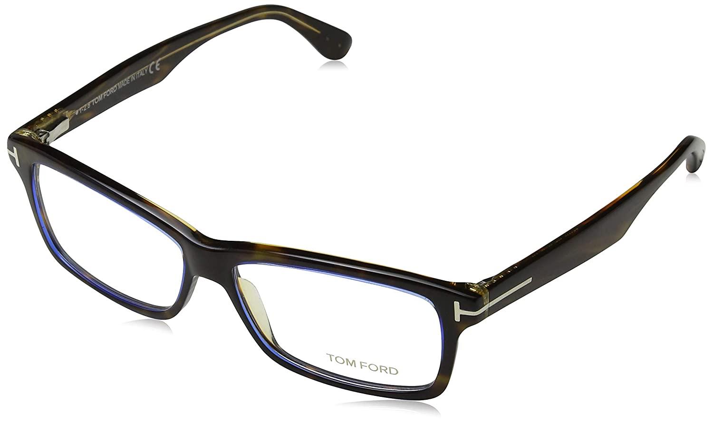

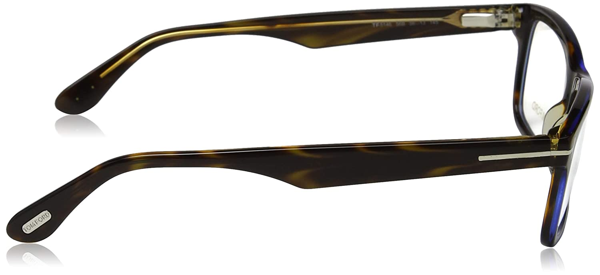

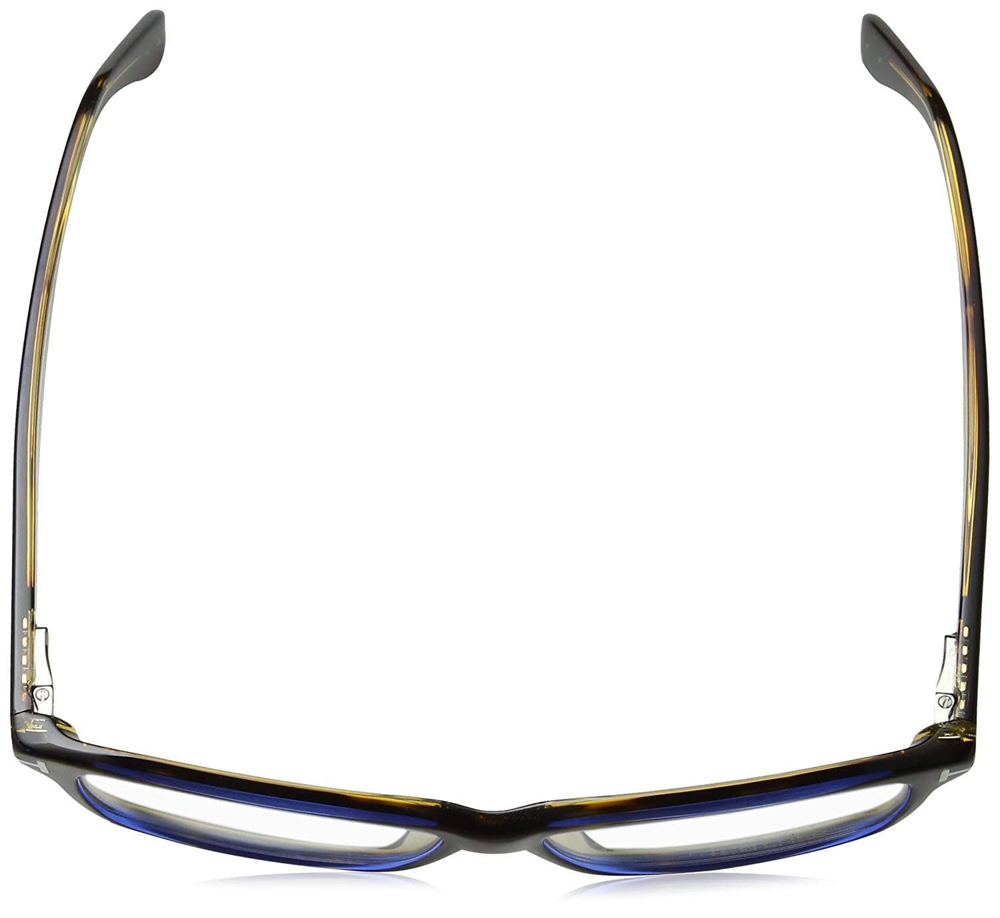

And these two lower quality images elsewhere on Amazon:

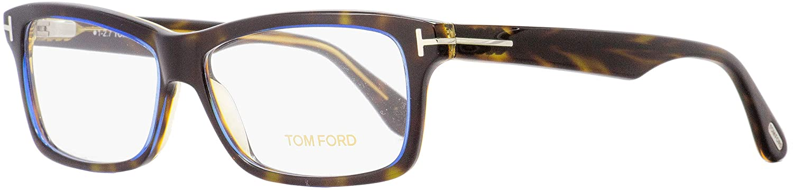

And finally these two much smaller image, elsewhere on the web:

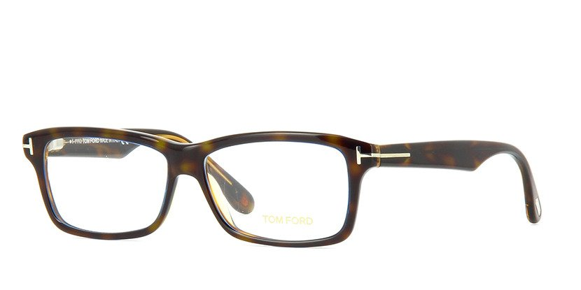

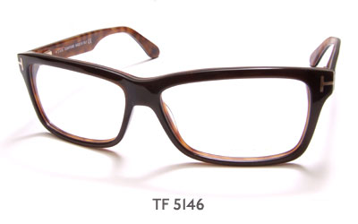

---

In the current Tom Ford range, the front of my glasses are somewhere between the FT5313 and the FT5663-B. But from the side they're more like the FT5304 (without the ribbing effect).

FT5313
------

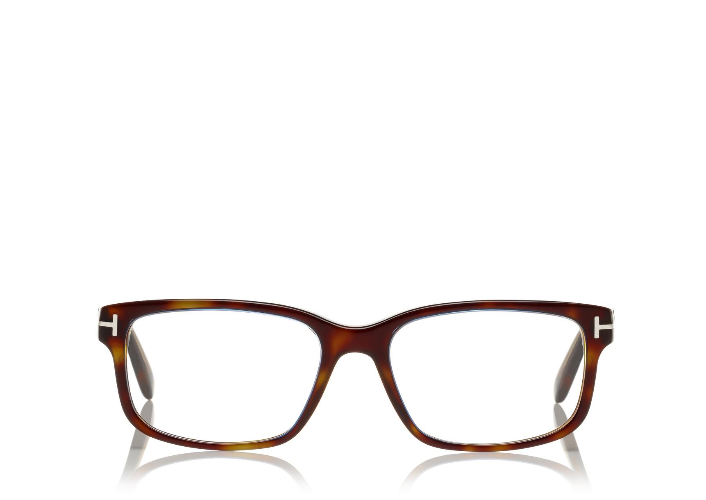

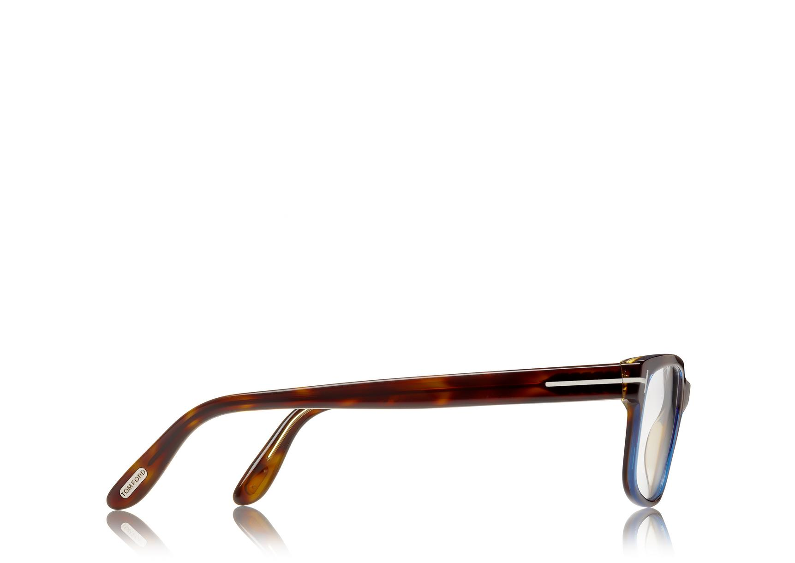

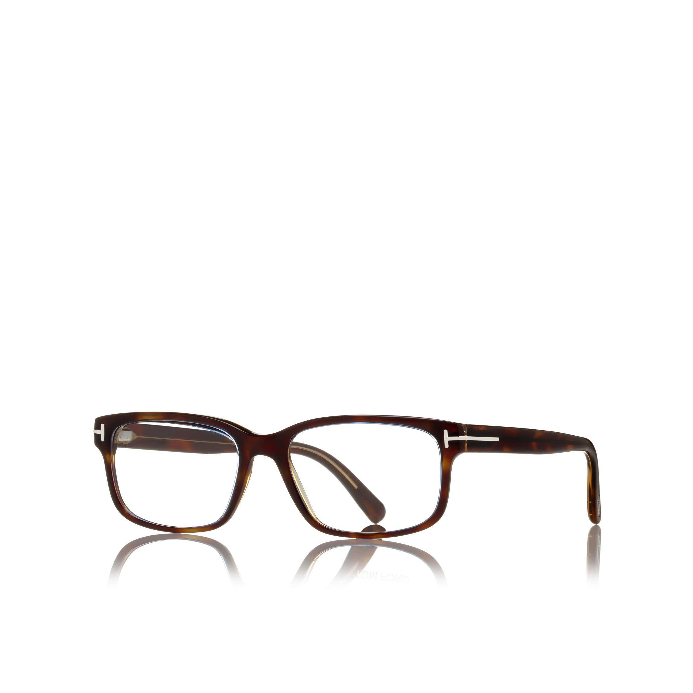

FT5663-B
--------

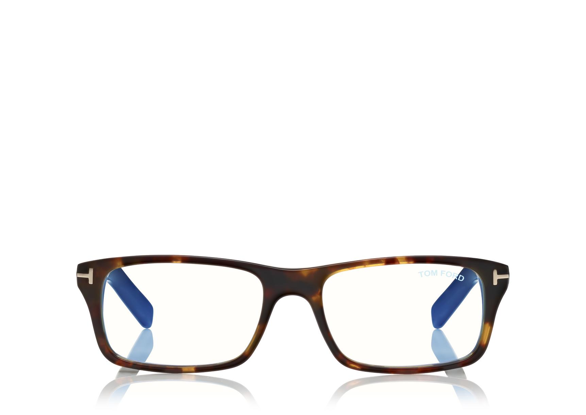

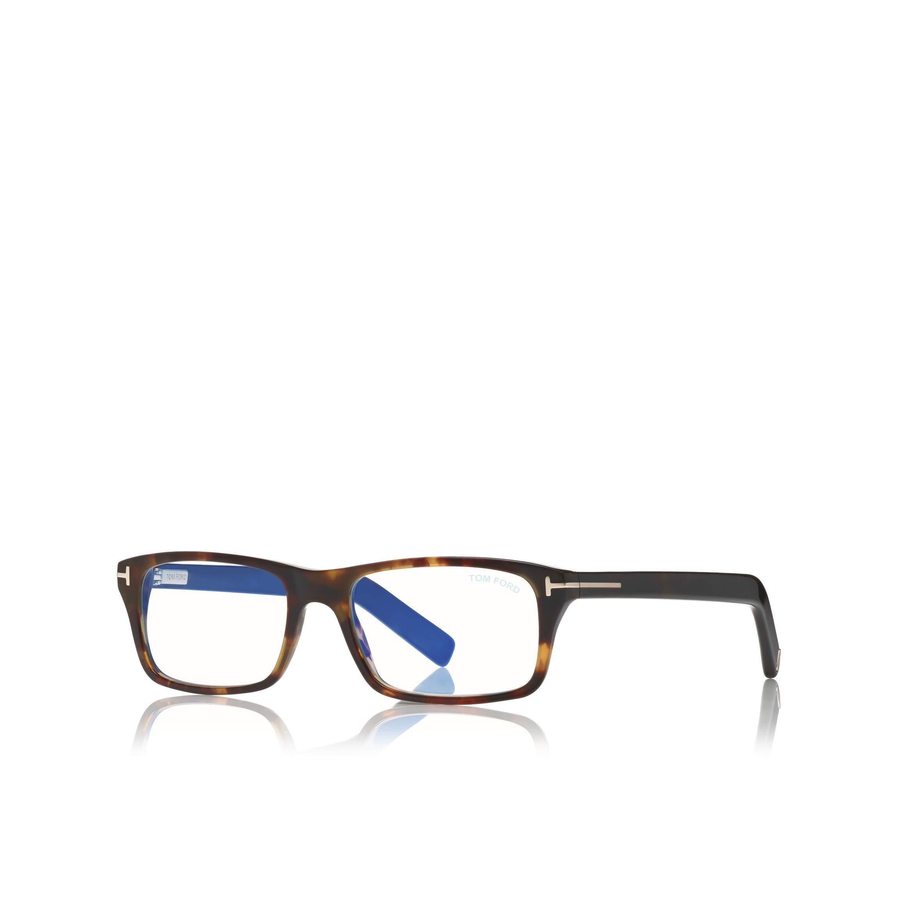

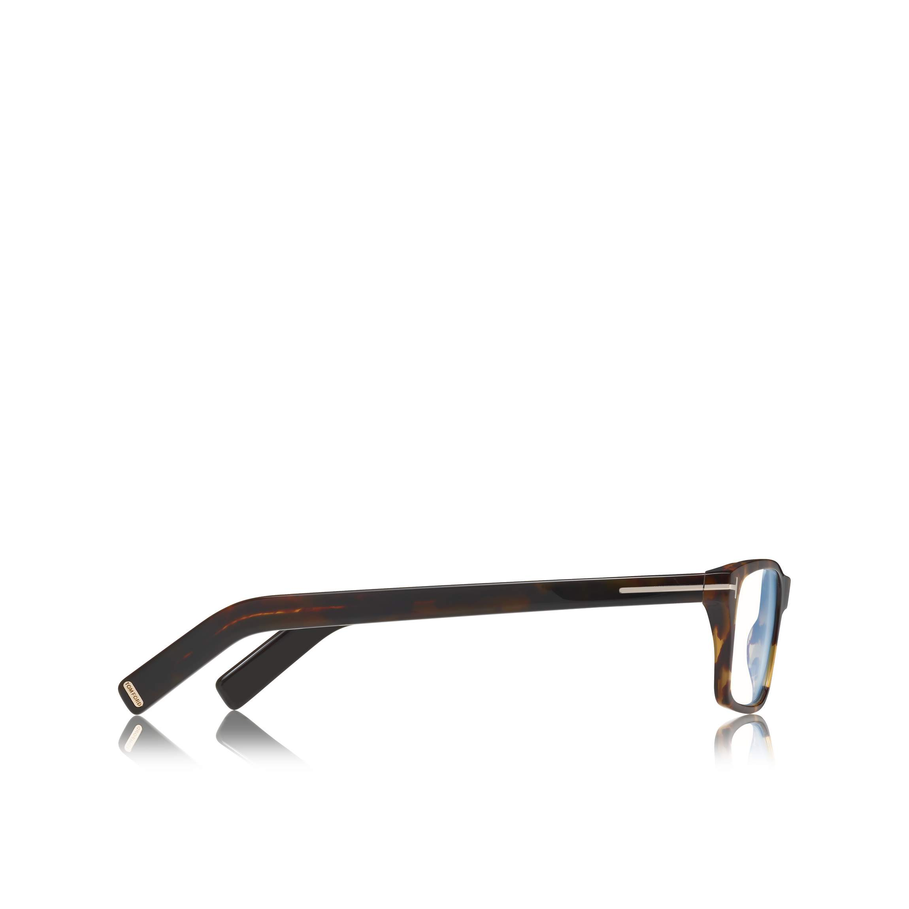

FT5304
------

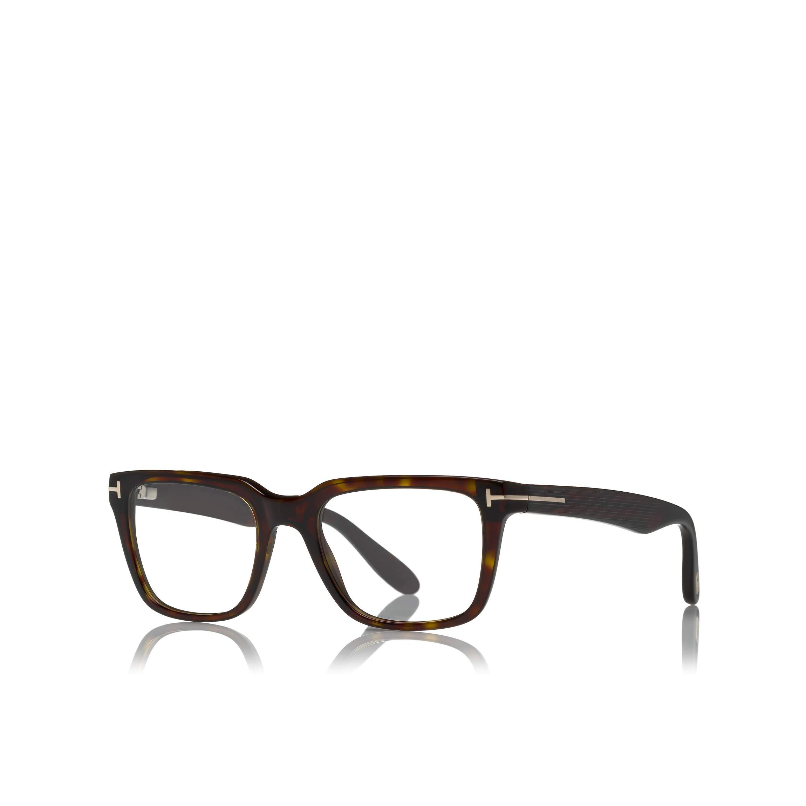

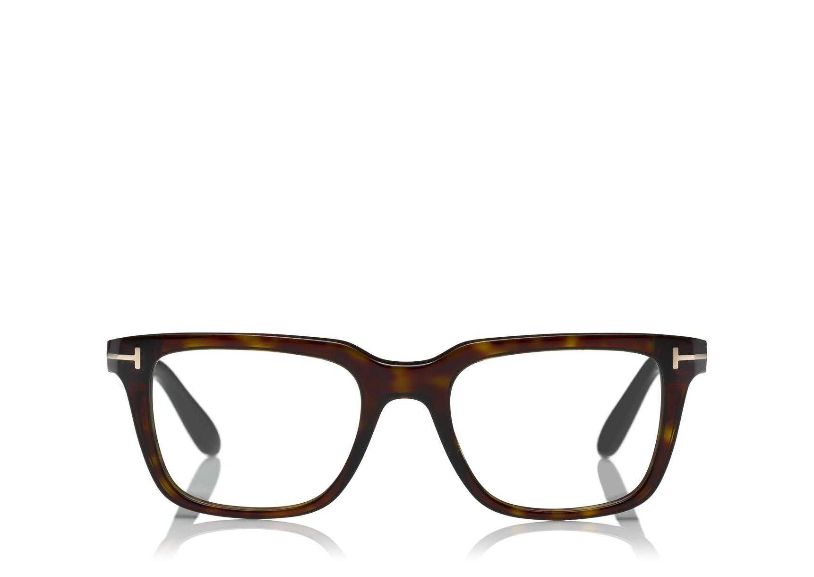

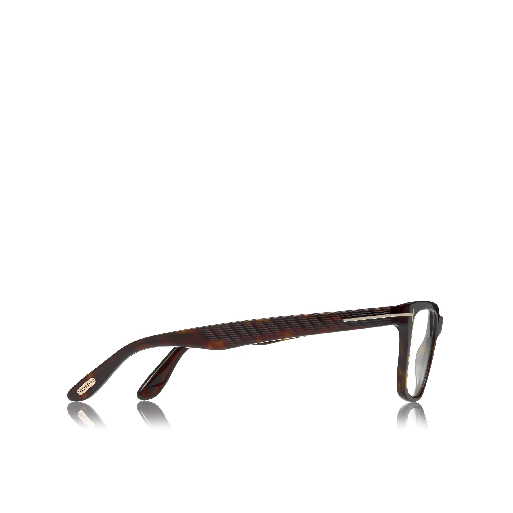

