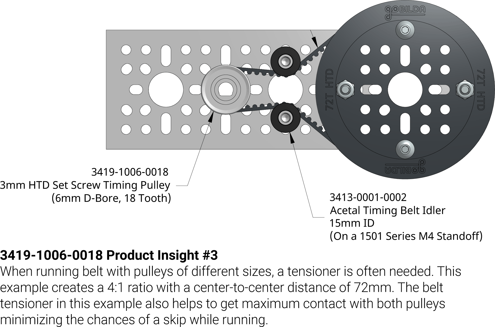
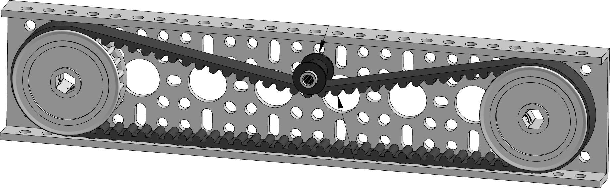
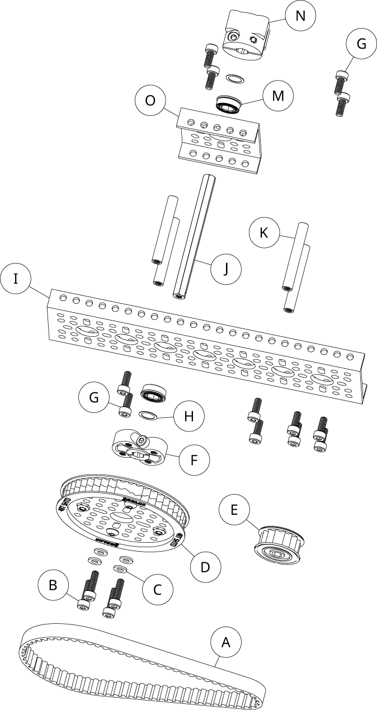
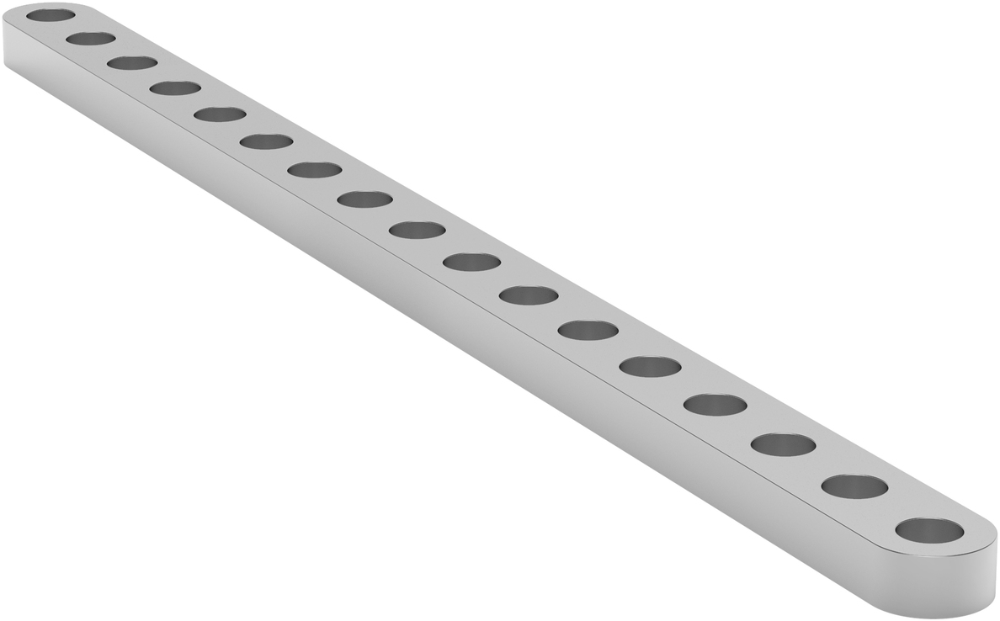
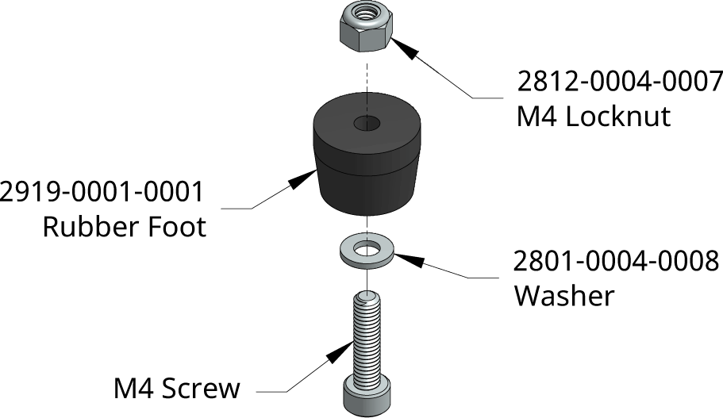
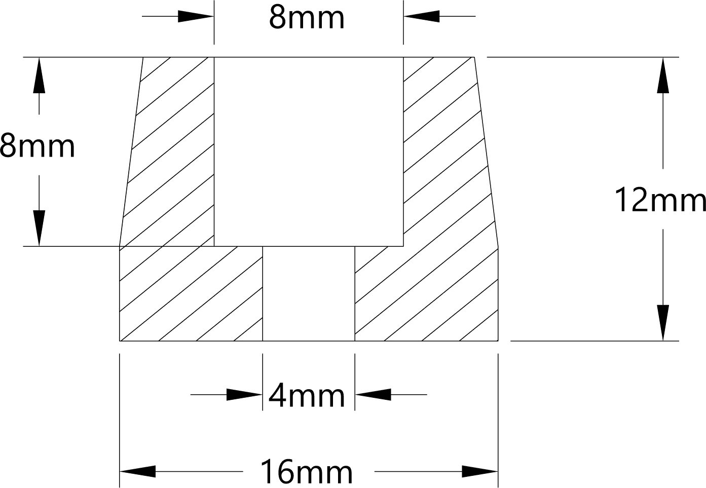
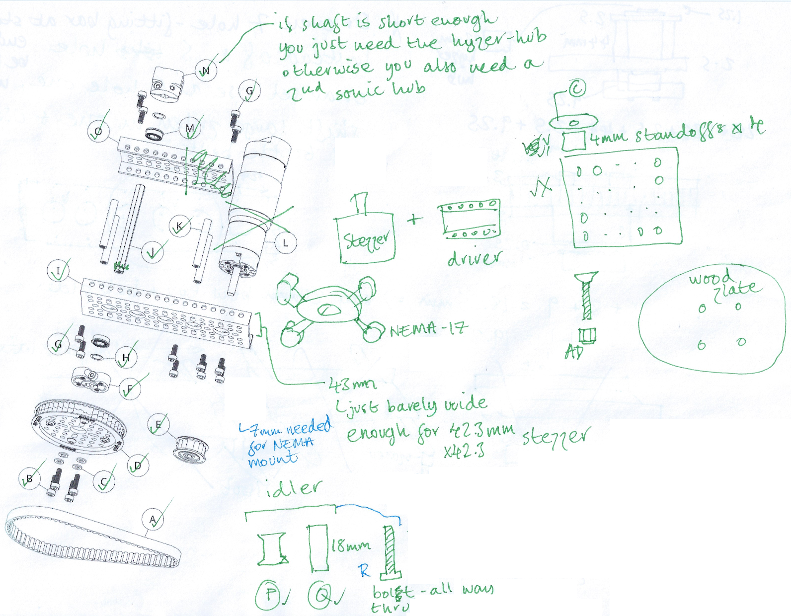
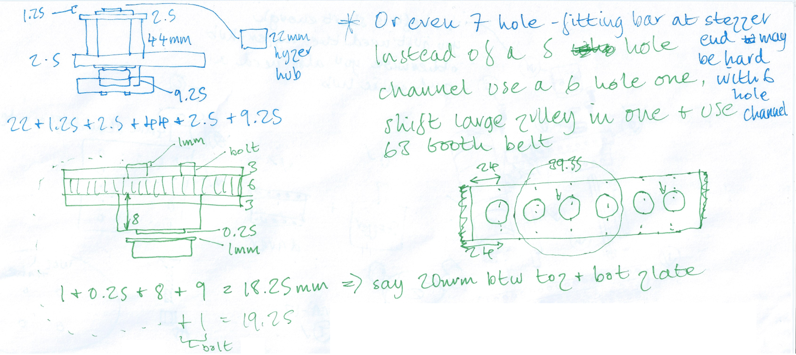
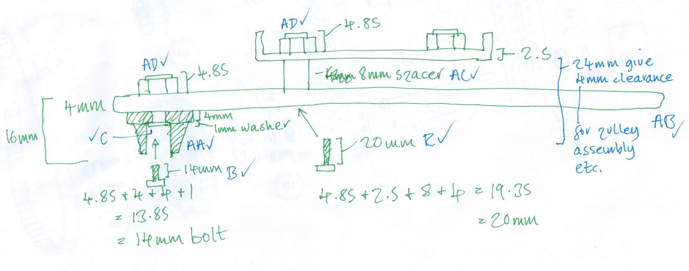

goBILDA turntable
=================

Parts
-----

### Pulleys and drive belt

| Qty | Item | SKU | Description |
|-----|------|-----|-------------|
| 1   | E | [3417-1006-0016](https://www.gobilda.com/3417-series-5mm-htd-pitch-set-screw-pinion-timing-belt-pulley-6mm-d-bore-16-tooth/) | 5mm 16 tooth shaft mount timing belt pulley |
| 1   | D | [3415-0014-0048](https://www.gobilda.com/3415-series-5mm-htd-pitch-hub-mount-timing-belt-pulley-14mm-bore-48-tooth/) | 5mm 48 tooth hub mount timing belt pulley |
| 1   |  B | [2800-0004-0014](https://www.gobilda.com/2800-series-zinc-plated-steel-socket-head-screw-m4-x-0-7mm-14mm-length-25-pack/) | 14mm M4 bolt (25 pack).
| 1   |  C | [2801-0004-0008](https://www.gobilda.com/2801-series-zinc-plated-steel-washer-4mm-id-x-8mm-od-25-pack/) |  8/4mm x 1mm washer (25 pack)
| 1*   | A  | [3412-0009-0360](https://www.gobilda.com/3412-series-5mm-htd-pitch-timing-belt-9mm-width-360mm-pitch-length-72-tooth/) |  72 tooth belt
| 1* | A  | [3412-0009-0340](https://www.gobilda.com/3412-series-5mm-htd-pitch-timing-belt-9mm-width-340mm-pitch-length-68-tooth/) |  68 tooth belt
| 1*   | A   | [3412-0009-0315](https://www.gobilda.com/3412-series-5mm-htd-pitch-timing-belt-9mm-width-315mm-pitch-length-63-tooth/) |  63 tooth belt

A 72 tooth belt is needed, if you go for the goBILDA layout where the pulley centers are 96mm apart. However, I intend to move them one hole closer - this requires a 63 tooth belt. But at this closeness even less of the small pulley's teeth are in contact, so maybe a 68 tooth belt with idlers would be better.

### Idlers

| Qty | Item | SKU | Description |
|-----|------|-----|-------------|
| 1   | P | [3413-0001-0001](https://www.gobilda.com/acetal-timing-belt-idler-6mm-id-x-12mm-od-12mm-width-1-1-2-pack/) | 5mm timing belt idler (2 pack)
| 1   | Q | [1501-0006-0180](https://www.gobilda.com/1501-series-m4-x-0-7mm-standoff-6mm-od-18mm-length-4-pack/) |  18mm x 6mm M4 standoff (4 pack)
| 1   | R | [2800-0004-0020](https://www.gobilda.com/2800-series-zinc-plated-steel-socket-head-screw-m4-x-0-7mm-20mm-length-25-pack/) |  20mm M4 bolt (25 pack)

An interesting alternative tensioning solution is the [arc-slot tensioner bracket](https://www.gobilda.com/1524-series-arc-slot-tensioner-bracket/).

### Shaft

| Qty | Item | SKU | Description |
|-----|------|-----|-------------|
| 2*   | F | [1309-0016-4008](https://www.gobilda.com/1309-series-sonic-hub-8mm-rex-bore/) |  8mm REX Sonic hub
| 1*   | J  | [2102-0008-0220](https://www.gobilda.com/2102-series-stainless-steel-rex-shaft-8mm-diameter-220mm-length/) |  8mm x 220mm REX shaft
| 1*   | J  | [2102-0008-0090](https://www.gobilda.com/2102-series-stainless-steel-rex-shaft-8mm-diameter-90mm-length/) |  8mm x 90mm  REX shaft
| 1   | N  | [1310-0016-4008](https://www.gobilda.com/1310-series-hyper-hub-8mm-rex-bore/) |  8mm REX Hyper hub

* You can choose a long shaft, to raise the plate above the drive mechanism. Or a short one and avoid the need for a second Sonic hub (instead using the Hyper hub for fixing the upper end of the shaft in place as well as attaching the plate). The longest available length is 220mm (shorter lengths can be found [here](https://www.gobilda.com/stainless-steel-rex-shafting/)). If using just a single Sonic hub and the Hyper hub then the ideal shaft length would be 82mm. The nearest available lengths are 80mm and 90mm, 90mm should be fine as the bottom pulley gives us 9mm of extra room to play with beyond the actual hub.

### Shaft support structure

| Qty | Item | SKU | Description |
|-----|------|-----|-------------|
| 1   | O  | [1121-0001-0048](https://www.gobilda.com/1121-series-low-side-u-channel-1-hole-48mm-length/) |  1-hole channel
| 1   | K  | [1501-0006-0440](https://www.gobilda.com/1501-series-m4-x-0-7mm-standoff-6mm-od-44mm-length-4-pack/) | 44mm standoffs
| 1   | M  | [1611-0514-4008](https://www.gobilda.com/1611-series-flanged-ball-bearing-8mm-rex-id-x-14mm-od-5mm-thickness-2-pack/) |  8mm REX shaft flanged ball bearing (2 pack)
| 1   | H  | [2807-0811-0250](https://www.gobilda.com/2807-series-stainless-steel-shim-8mm-id-x-11mm-od-0-25mm-thickness-12-pack/) | 8mm shim (12 pack).

Alternatives to the 1-hole channel would be a cheaper but less rigid [1-hole pattern plate](https://www.gobilda.com/1123-series-pattern-plate-1-x-1-hole-48-x-48mm/) or a [pillow block](https://www.gobilda.com/1603-series-face-thru-hole-pillow-block-8mm-bore/) (but it does not have a REX shaft bearing).

The 44mm standoff length is chosen to create an upper platform that roughly lines up with the top of the stepper motor. The motor is 38mm high, the NEMA mount is 8mm high = 46mm. The 44mm standoffs plus the 2.5mm thickness of the 1-hole channel = 46.5mm.

### Motor mount

| Qty | Item | SKU | Description |
|-----|------|-----|-------------|
| 1   | T | [1700-0016-0017](https://www.gobilda.com/1700-series-face-tapped-stepper-motor-mount-nema-17/) |  NEMA 17 motor mount (M3 screws for bolting on motor are included)
| 1   | AE | [2800-0004-0007](https://www.gobilda.com/2800-series-zinc-plated-steel-socket-head-screw-m4-x-0-7mm-7mm-length-25-pack/) |  7mm M4 bolts (25 pack)

The 7mm bolts go thru the 2.5mm channel and 5mm threads in mount. 7mm bolts are used, rather than 8mm ones, as the bolts mustn't extend beyond the other side of the mount.

### Plate mount

| Qty | Item | SKU | Description |
|-----|------|-----|-------------|
| 1   | X  | [1116-0056-0056](https://www.gobilda.com/1116-series-grid-plate-7-x-7-hole-56-x-56mm/) |  A grid plate
| 1   | Y  | [1502-0006-0040](https://www.gobilda.com/1502-series-4mm-id-spacer-6mm-od-4mm-length-4-pack/) |  4mm spacers
|    | | | Washers (already covered by C)
|    | | | Locknuts (already covered by AD)

This mount is then attached to the shaft using the Hyper hub (covered above in the shaft section).

An alternative all-in-one (but far smaller) mount would be the [quad block pattern mount](https://www.gobilda.com/1201-series-quad-block-pattern-mount-43-2/).

### Bottom channel

| Qty | Item | SKU | Description |
|-----|------|-----|-------------|
| 1   | I  | [1121-0007-0192](https://www.gobilda.com/1121-series-low-side-u-channel-7-hole-192mm-length/) |  7-hole low-side u-channel
| 1   | G  | [2800-0004-0010](https://www.gobilda.com/2800-series-zinc-plated-steel-socket-head-screw-m4-x-0-7mm-10mm-length-25-pack/) | 10mm M4 bolt (25 pack).

The original [5-hole low-side u-channel](https://www.gobilda.com/1121-series-low-side-u-channel-5-hole-144mm-length/) only works if you don't need stablizing legs. A slightly cheaper but less rigid alternative to the u-channel would be an equivalent size [pattern plate](https://www.gobilda.com/pattern-plates/).

### Stablizing legs

| Qty | Item | SKU | Description |
|-----|------|-----|-------------|
| 1     | AB | [1102-0017-0136](https://www.gobilda.com/1102-series-flat-beam-17-hole-136mm-length-2-pack/) |  Flat beam (2 pack)
| 1     | AA | [2919-0001-0001](https://www.gobilda.com/12mm-tall-rubber-foot-1-1-8-pack/) |  Rubber feet (8 pack)
| 1     | AD | [2812-0004-0007](https://www.gobilda.com/2812-series-zinc-plated-steel-nylon-insert-locknut-m4-x-0-7mm-7mm-hex-25-pack/) |  M4 locknut (25 pack)
| 1     | AC | [1502-0006-0080](https://www.gobilda.com/1502-series-4mm-id-spacer-6mm-od-8mm-length-4-pack/) |  8mm spacers (4 pack)
|       |    | | 14mm M4 bolts (already covered by B)
|       |    | | 20mm M4 bolts (already covered by R)
|       |    | | Washers (already covered by C)

Notes
-----

The 22mm and shorter standoffs have threads that go all the way through. Above 22mm, they just support a maximum screw depth of 8mm at each end. This combined with the 2.5mm thickness of the plates and channels, that they're typically attached to, mean that they're generally used with 10mm M4 screws. E.g. see the screws labelled _G_ [here](https://cdn11.bigcommerce.com/s-eem7ijc77k/images/stencil/original/products/2229/27423/3417-1006-0016-Product-Insight-3__72788.1606836211.png).
  
Choosing REX bore shafts means that some cheaper options are not available to you, e.g. the [classic clamping hub](https://www.gobilda.com/1301-series-clamping-hub-8mm-bore/) is only available for round bore shafts.

Plate
-----

Flat headed M4 screw (not available from goBILDA) and a laser cut wooden plate.

Pololu
------

* [#2267](https://www.pololu.com/product/2267) - 2.8V/1.7A 42x38mm 200 steps/rev bipolar stepper motor.
* [#2133](https://www.pololu.com/product/2133) - DRV8825 stepper motor driver board (high current).
* A 12V power supply.
* A 25V rated electrolytic capacitor with a capacitance of at least 47uF.
? - there's also a driver that can work off a 5V supply, is there any reason to choose the 12V one?
  - you also need a 47uF (or 100uF - they seem more common) electrolytic capacitor - the voltage rating of the cap should be about twice you supply voltage.
* grommets to damp vibration of motor.

Using the DRV8825 with the Pi: https://www.youtube.com/watch?v=LUbhPKBL_IU

47uF is a common capacitance, however, 100uF is slightly more common and just as suitable. The rule-of-thumb seems to be that you should choose a cap with a voltage rating that's twice as high as the voltage being used, e.g. for a 12V setup use a cap rated for 25V.

Note: there's also a variant of the driver that can take an input voltage of 5V. However, everyone seems to use the 12V capable variant. Is there any reason for choosing one over the other beyond the voltages involved?

TODO: how much current does the motor draw, i.e. what's the minimum acceptable current rating for the 12V power supply?

Tensioners
----------

From the perspective of the wheels, is there any advantage to using two tensioners vs just one?

### Two tensioners

Here it shows two tensioners and mentions that they help to minimize skipping:  

### One tensioner

But can't you achieve the same amount of contact by just applying all the tension from one side?  

Pictures
--------

See [`images`](images) subdirectory for `.xcf` files that have already been somewhat adapted to reflect this design.

---

### Legs

Scans
-----

