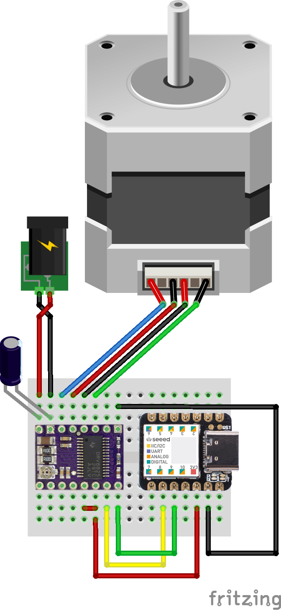
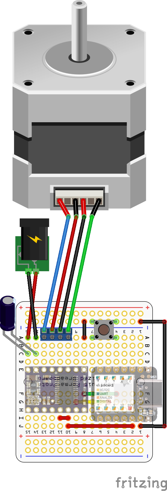
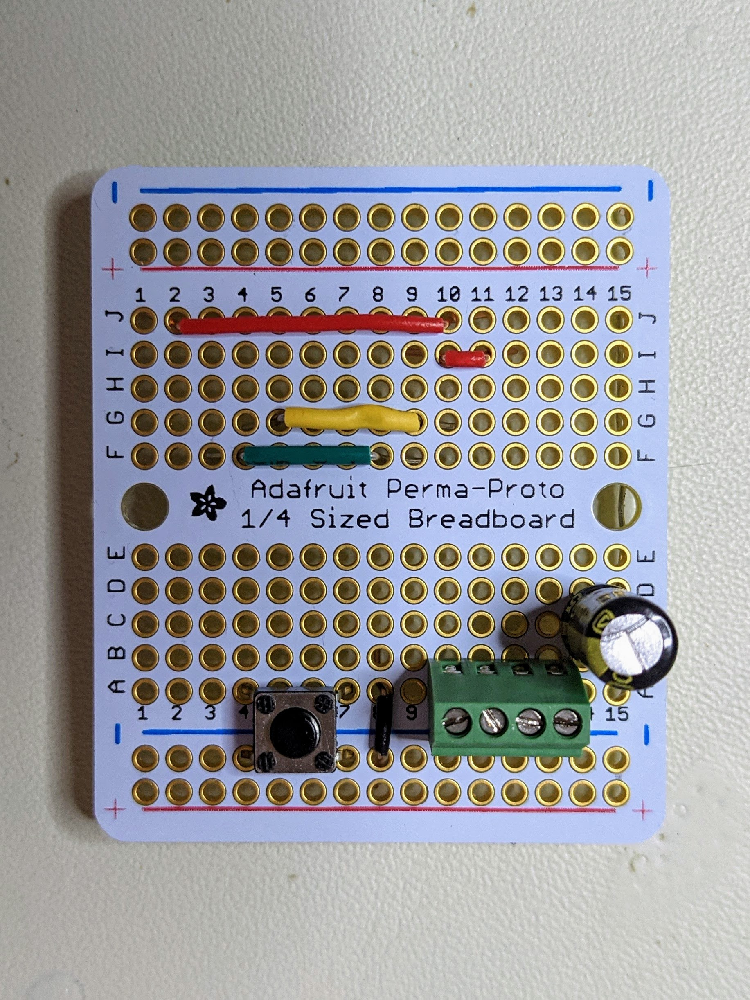
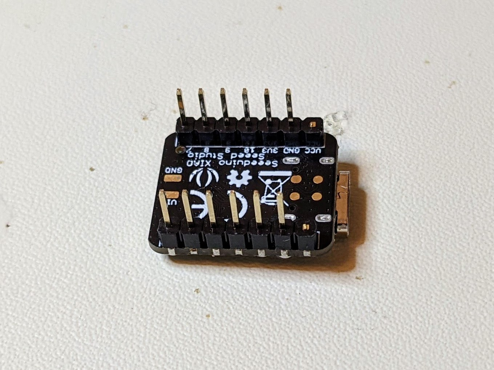
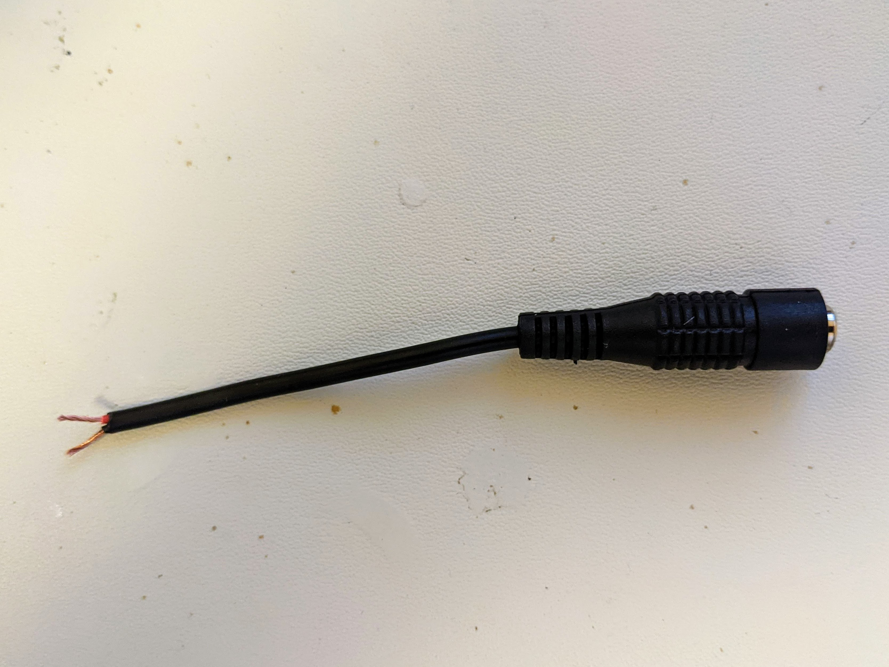
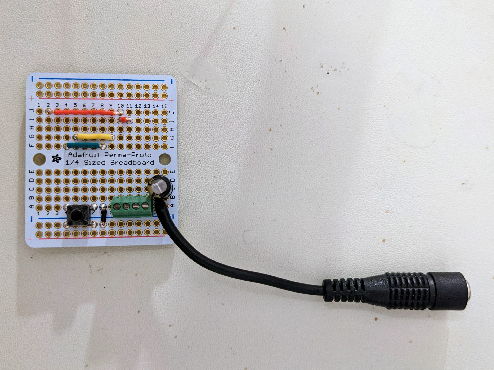
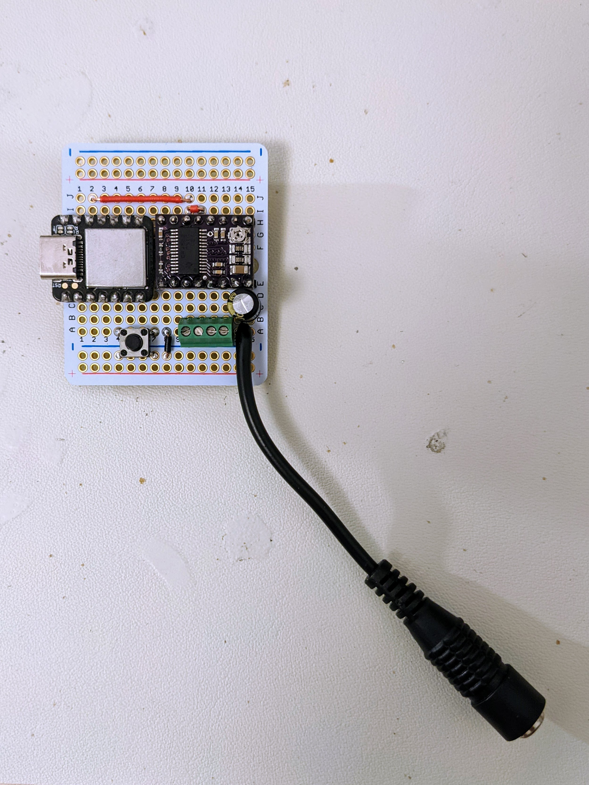
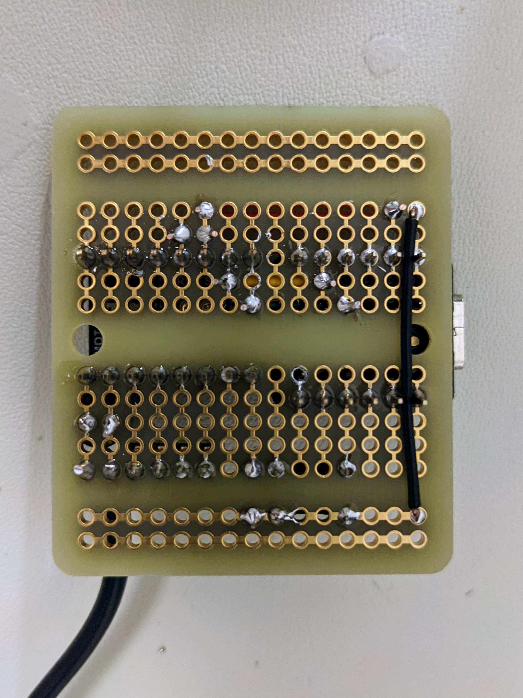
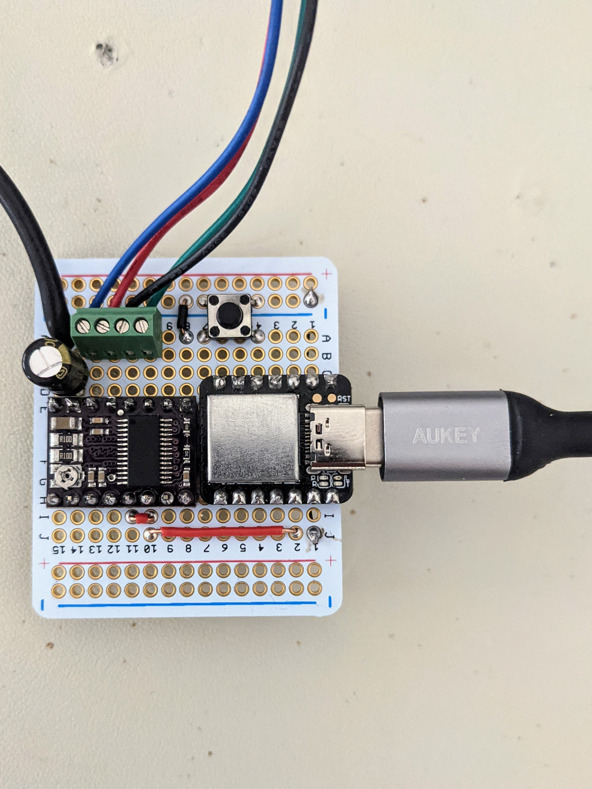

Install CircuitPython on Xiao
-----------------------------

Note: there's currently no version of MicroPython for the Xiao - you have to use CircuitPython.

Seeed released the v3.7.0-33 bootloader for the Xiao in late 2019 and haven't updated it since. Installing this bootloader requires a J-Link (see this forum [post](https://forum.seeedstudio.com/t/possible-reset-boot-loader-problem/252560/2)).

Adafruit have a bootloader (for the essentially identical [Qt Py](https://www.adafruit.com/product/4600)) that you can update far more easily - so let's do that first.


Attach the Xiao via USB to your computer. By default the Xiao comes with Arduino compatible firmware and in normal mode does not appear as a USB drive when connected to your computer.

Enter bootloader mode by touching one end of a jumper wire to the RST disc (top-left beside the USB connector) and, with the other end of the jumper cable, double tapping the disc immediatelly below it. I.e. short the reset pin.

It took me a few attempts to get this right - once done correctly, the orange LED pulses on and off more slowly and the Xiao appears as a USB drive called `Arduino`:

```
$ cd /media/$USER/Arduino
$ ls
CURRENT.UF2  INDEX.HTM  INFO_UF2.TXT
$ cat INFO_UF2.TXT 
UF2 Bootloader v3.7.0-33-g90ff611-dirty SFHWRO
Model: Seeeduino XIAO
Board-ID: SAMD21G18A-XIAO-v0
```

Just download the latest `update-bootloader-QTPy_m0` file found on the Adafruit bootloader [releases page](https://github.com/adafruit/uf2-samdx1/releases/) and copy it to the Xiao:

```
$ cp ~/Downloads/bootloader-QTPy_m0-v3.13.0.bin /media/$USER/Arduino
```

The Xiao will temporarily dissappear as it installs the file and then reappear (in normal mode) as `QTPY_BOOT`:

```
$ cat /media/$USER/QTPY_BOOT/INFO_UF2.TXT
UF2 Bootloader v3.13.0 SFHWRO
Model: QT Py M0
Board-ID: SAMD21E18A-QTPy-v0
```

Note that the board ID refers to the SAMD21E18A while the one above refers to the SAMD21G18A - they're near identical chips but the SAMD21G18A is slightly more capable.

Normally, the board would restart into normal mode rather than bootloader mode but updating the bootloader erased the normal mode setup - so lets install the CircuitPython firmware.

Just download the latest `.uf2` file for the Xiao from its [CircuitPython page](https://circuitpython.org/board/seeeduino_xiao/) and copy it to the Xiao:

```
$ cp ~/Downloads/adafruit-circuitpython-seeeduino_xiao-en_US-7.0.0.uf2 /media/$USER/QTPY_BOOT
```

Again Xiao will temporarily dissappear as it installs the file and then reappear (in normal mode) as `CIRCUITPY`:

```
$ cd /media/$USER/CIRCUITPY
$ ls
boot_out.txt  code.py  lib/
$ cat boot_out.txt 
Adafruit CircuitPython 7.0.0 on 2021-09-20; Seeeduino XIAO with samd21g18
```

You can now copy a program like this to `/media/$USER/CIRCUITPY/code.py`:

```Python
import time
import board
from digitalio import DigitalInOut, Direction

led = DigitalInOut(board.D13)
led.direction = Direction.OUTPUT

while True:
    led.value = not led.value
    time.sleep(1)
```

Note: the Xiao has an LED on pin 13 whereas the Qt Py had to sacrifice it to make space for a more convenient reset button, a STEMMA connector and a NeoPixel.

Setting the motor driver current limit
--------------------------------------

These notes are based on following the Pololu YouTube video ["Setting the Current Limit on Pololu Stepper Motor Driver Carriers"](https://youtu.be/89BHS9hfSUk).

I'm using the Pololu _Stepper Motor: Bipolar, 200 Steps/Rev, 42×38mm, 2.8V, 1.7 A/Phase_ (part [#2267](https://www.pololu.com/product/2267)) - the important bit here for setting the current limit is the 1.7 A/phase.

The continuous current rating of the DRV8825 is 1.5A (see [here](https://www.pololu.com/product/2133/specs)).

So the recommendation that you chose a driver rated for higher that the A/phase value of the motor and then adjust its current limit down to that of the motor doesn't work here.

So instead let's set the current limit to the maximum continuous current of the driver, i.e. 1.5A, rather than the 1.7A of the motor.

Using the equation _current limit = VREF x 2_ gives a VREF value of 1.5 / 2, i.e. 0.75V

Note: the equation is specific to the driver - you can find the above equation on the [DRV8825 page](https://www.pololu.com/product/2133).

Adjusting the potentiometer on the DRV8825 board was quite fiddly - a quarter turn corresponded to about a 0.9V change in VREF so a tiny twist to the potentiometer results in a big VREF change. Using multimeter probes that can be clipped to the screwdriver and ground would make adjustment much easier.

Note: as described [here](https://www.youtube.com/watch?v=89BHS9hfSUk&t=353s) we can actually set things a little higher as the driver limits the current to 71% of the maximum but 100% is OK _if we only intended to use the motor in single stepping mode_ - which is the case here. In the referenced video, they're using a 1 A/phase motor, remember to adjust from this to the actual A/phase for the motor you're using.

See [`motor-driver.py`](motor-driver.py)

Power consumption
-----------------

As you can see in the video (they use a 1 A/phase motor rather than the 1.7 A/phase one used here) the power consumption is very low.

A 12V 1A wall adapter is more than enough to power the DRV8825 board and the motor, e.g. something like [this](https://www.reichelt.com/ch/en/plug-in-power-supply-12-w-12-v-1-a-hnp-12-120v2-p298325.html) costs just &euro;7.

Wiring the leads from the stepper
---------------------------------

The [product page](https://www.pololu.com/product/2267) for the motor shows this diagram:


While the [FAQ page](https://www.pololu.com/product/2133/faqs) for the DRV8825 board shows this diagram:


And then says:

> The above diagram shows a standard bipolar stepper motor. To control this with the DRV8824/DRV8825, connect stepper leads A and C to board outputs A1 and A2, respectively, and stepper leads B and D to board outputs B1 and B2, respectively.

Wiring
------



Don't miss out the tiny wire connecting RESET and SLP together.

The cap is a 100uF 25V electrolytic like this [one](https://www.sparkfun.com/products/96) (I used one of [these](https://www.reichelt.com/ch/en/e-cap-radial-100-uf-25-v-105-c-low-esr-fm-a-100u-25-p200027.html) from Reichelt).

You can then drive the motor with [`motor-driver.py`](motor-driver.py).

Permaproto
----------



The yellow and green wires are on the top surface of the permaproto board but run underneath the breakout boards. The main ground wire (right) is the only wire run underneath the permaproto.

**Important:** the 5V and A0 pins of the Xiao had to be snipped off (they aren't needed) in order to fit both boards onto the permaproto.

The button was just added in for experimenting - so I could trigger certain actions directly from the board. I would omit it in a final design and probably route the main ground wire on the top of the permaproto, running from _underneath_ the Xiao diagonally across to where it needs to be connected to the DRV8825 board.

_Basic elements ready to be soldered._  


_Legs either side of USB connector removed._


_Barrel jack connector for 12V._  


_Basic soldering completed._  


_Breakout boards soldered._  


_Final ground wire soldered._  


_Ready to go._  
