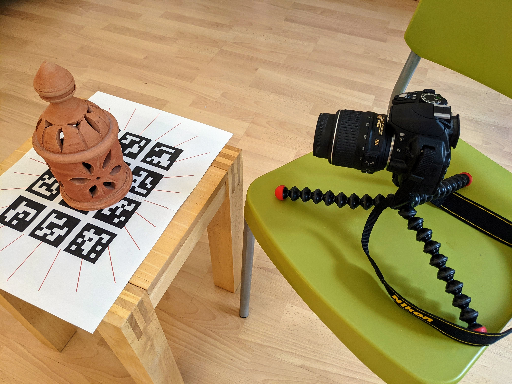
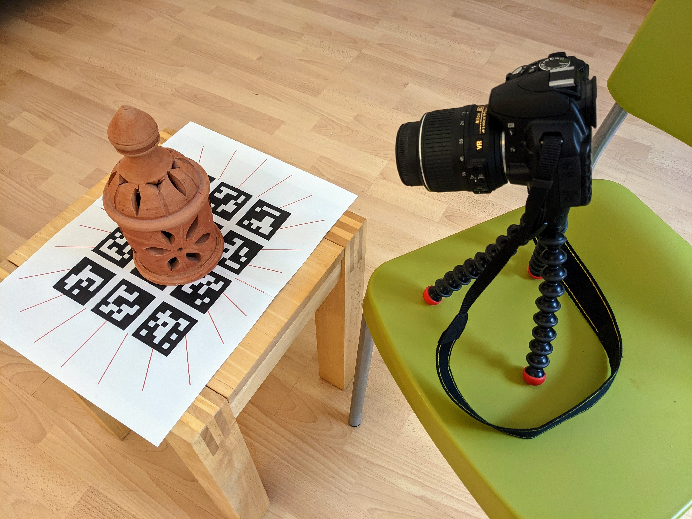
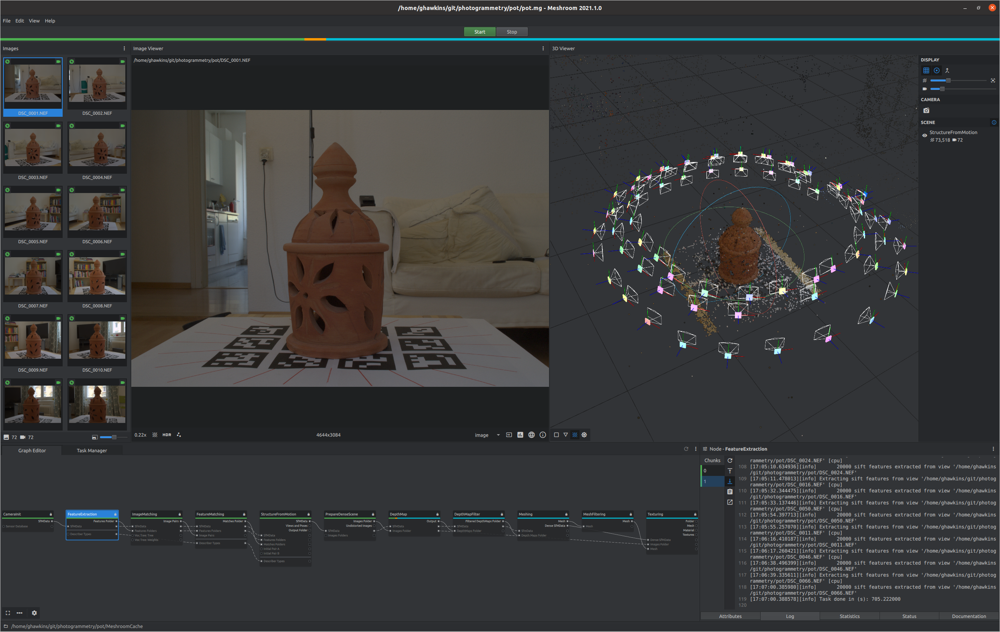
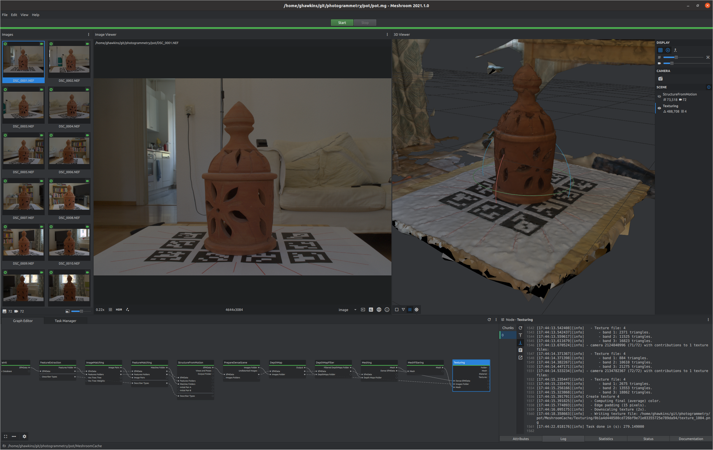
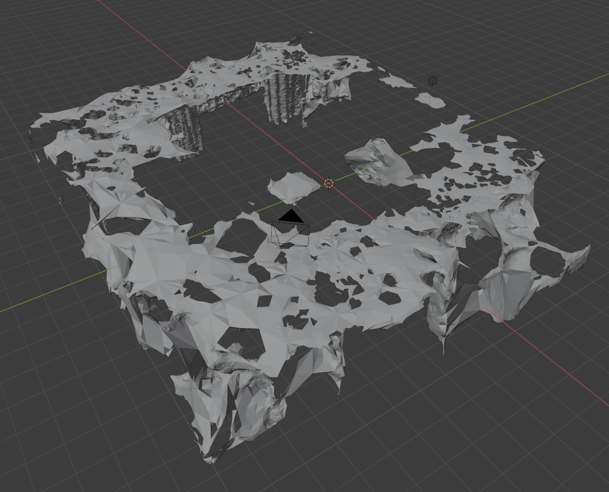
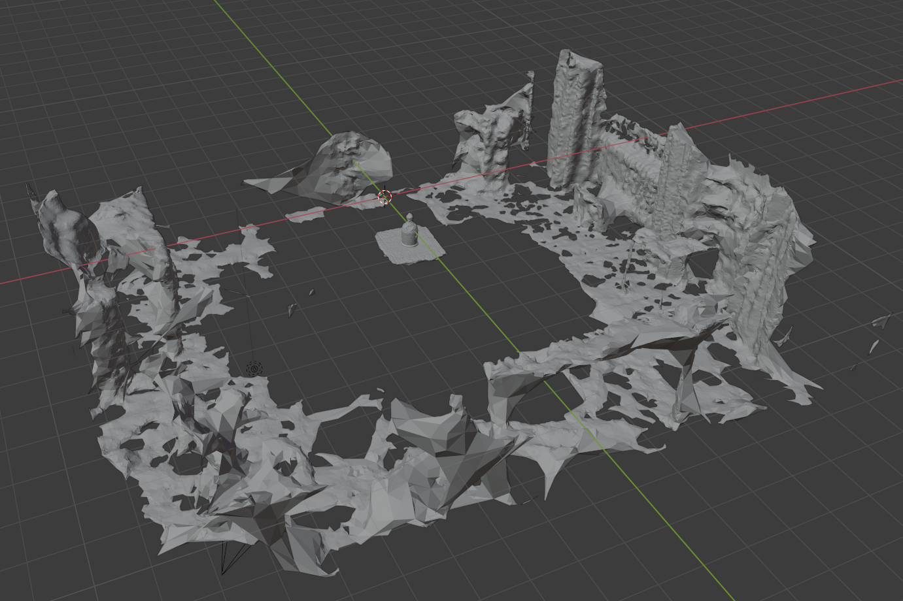
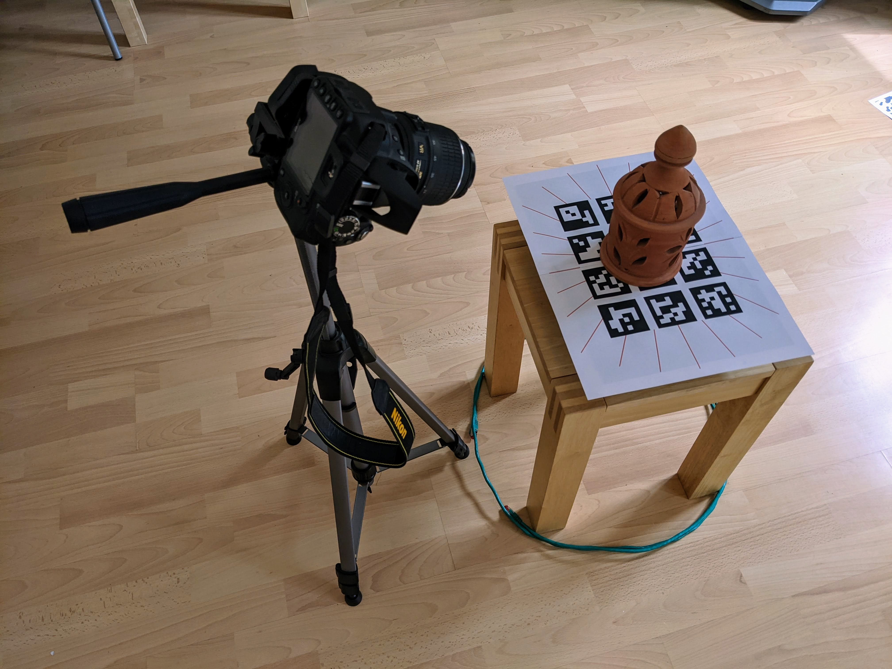
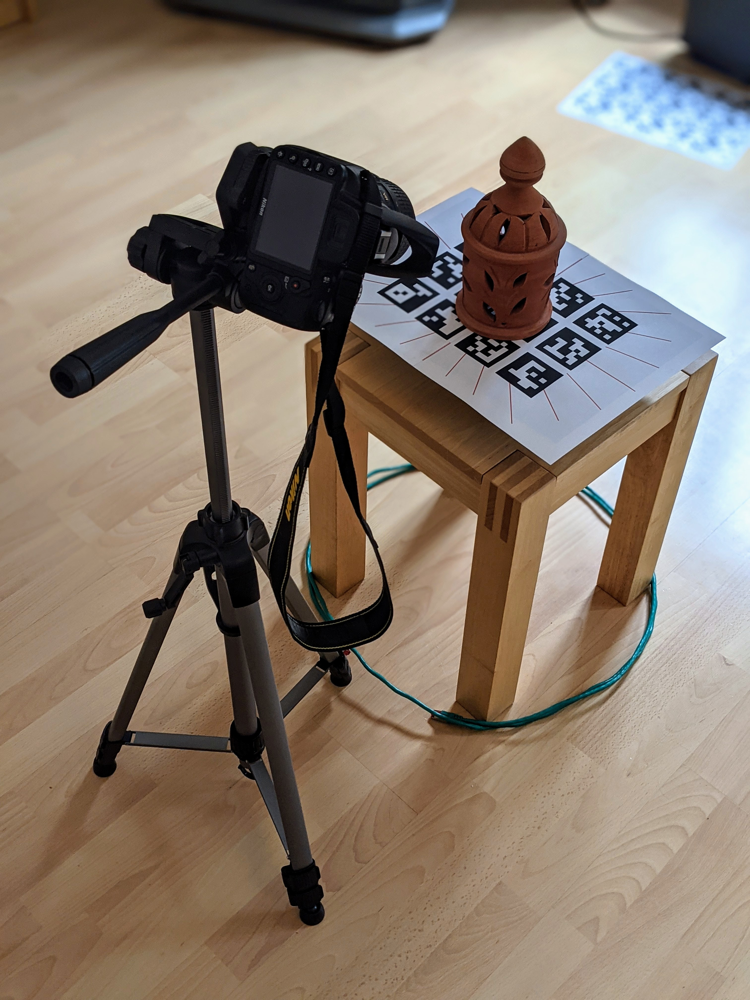
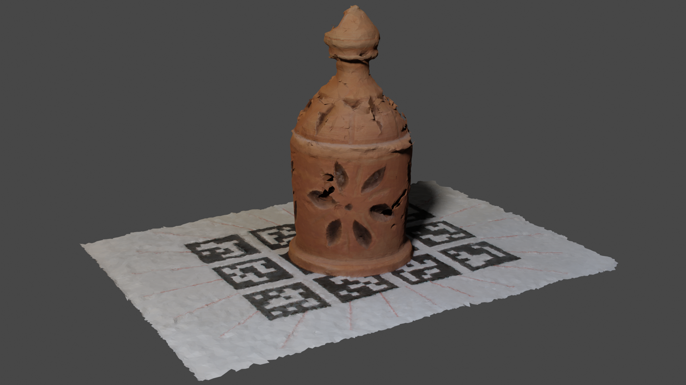
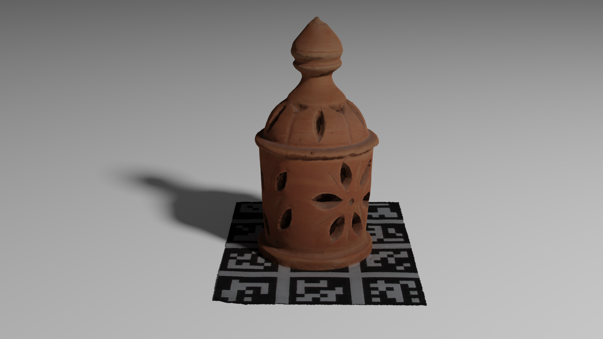

Camera setup
------------

In the settings, I selected _Reset shooting options_

I set _Image quality_ to _NEF (RAW) + JPEG Fine_

I set the mode dial to _A (Aperture-Priority Auto)_

I turned the command dial until the camera's LCD monitor showed F22 as the aperture number.

Knowing that the exposure will be really long, I didn't want me pressing the shutter-release button to cause shake at the start of the exposure.

So I turned the release-mode selector to _Self-Timer_ and in the settings set the _Self-timer delay_ to 2s (the lowest available value).

Scene setup
-----------

I printed out the patterns that I hoped would help Meshroom determine pose and orientation, placed this on a small wooden stool and placed the subject on the pattern.

I attached the camera to a small tripod and adjusted this to the lowest possible height and place camera and tripod on a chair.

Using the degree markings, that I'd also included on my pattern, as a guide (one marking every 15&deg;) I moved the chair around the subject, taking one photo at each marking.

I then raised the tripod to half its maximum height and did the same again.

I then raised the tripod to its maximum height, with one of the legs facing directly forward (to prevent the weight of the camera lens causing it to topple forward) and did the same again.

I tried to maintain the entire subject in each photo. For all photos, the camera was very close to the subject but for the final sequence, I tried to get the tripod as close to the chair edge so I could look down on the subject as much as possible.

So the first round was of the side of the subject, the second round up and somewhat looking down and the final set up and looking down as much as possible.

_Camera low._  


_Camera high._  


First impressions
-----------------

A remote shutter release looks to be almost essential - even with the 2s delay, pressing the shutter release introduces a lot of vibration.

Perhaps a small but more stable tripod than a Joby Gorillapod would be a good investment.

An always on LCD that you can angle would also be very convenient, so you can see what the camera sees as you move the camera around the subject. Eventually, I just moved the camera without checking that the subject was centered and this worked out OK. With a turntable this wouldn't be such an issue after centering the subject at the start.

A/C power adapter
-----------------

The battery running out becomes an issue if you're doing extended shoots. An A/C adapter would get in the way when moving the camera as here but with a turntable, it'd be very convenient.

The Nikon A/C adapter is truly ludicruously priced - $40 just for the dummy battery and then another $40 for the power supply (with propreitary connector).

You can get something similar (dummy battery and power supply) for $20 on AliExpress - https://www.aliexpress.com/item/4000274302075.html

And as the 9V 6A power supply doesn't use a propreitary connector it's actually useable for other purposes as well.

Meshroom
--------

**Update:** once you're used to the simple workflow for Meshroom, check out Gleb Alexandrov's ["Complete Meshroom Tutorial"](https://www.youtube.com/watch?v=j3lhPKF8qjU) for a much more sophisticated workflow. In particular, he covers preprocessing the RAW images with [darktable](https://www.darktable.org/) and a much more sophisticated low-poly mesh (using the shrink-wrap modifier along with normal and displacement maps to create a low-poly result that's far closer to the origina high-poly mech visually).

Copy the image files (`.NEF` and `.JPG`) from the camera SD card to the computer.

Download and install [Meshroom](https://alicevision.org/#meshroom).

Run Meshroom:

```
$ cd ~/Meshroom-2021.1.0-av2.4.0-centos7-cuda10.2
$ ./Meshroom
```

Drag the `.NEF` files into the Meshroom images area (it's not necessary to wait for the thumbnails to load).

Press _Start_ and when prompted chose a location and name for the Meshroom project file - the file is save with a `.mg` suffix (then press _Start_ again).

Meshroom creates a directory called `MeshroomCache` in the directory where you saved the `.mg` file.

You can check that it detected your CUDA enabled graphics card like so:

```
$ cat MeshroomCache/FeatureExtraction/*/0.log
Program called with the following parameters:
 * contrastFiltering =  Unknown Type "N11aliceVision7feature26EFeatureConstrastFilteringE"
 ...

[16:40:43.416403][info] CUDA-Enabled GPU.
Device information:
	- id:                      0
	- name:                    GeForce RTX 2060
    ...
```

You can also see the same log by clicking on the _FeatureExtraction_ node in the Meshroom _Graph Editor_ and then switch to the node's _Log_ tab.

By watching the log output, you can track it very slowly processesing the photos.

Note: in the log pane, you'll see a _Chunks_ section - some nodes may involve multiple sequential chunks. As one chunk finishes its work, you have to select the subsequent chunk in order to see its log output and so on.

About half-way through (once the _StructureFromMotion_ node has completed), it's derived the position of the camera for each of the photos and you see these plus the calculated point cloud:



For whatever reason, Meshroom always/often seems to reconstruct my scenes upside-down, irrespective of the original camera orientation.

The whole process took about an 1h 3m on my fairly capable computer.

In various tutorials they tell you to click the _Load models_ button at the end of the process.

This button seems to have been removed (see this GitHub [issue](https://github.com/alicevision/meshroom/issues/1094)) and instead you double click the _Texturing_ node now to load the finished model.

In the _Scene_ pane you then see a _StructureFromMotion_ entry and a _Texturing_ entry, each with little eye icons beside them - you can toggle off the eye icon besite _StructureFromMotion_ to see the resulting model on its own.

There's nothing to save - it's all been saved - the resulting `.obj` file is in a subdirectory of the `MeshroomCache`:

_Final model and texture._  


```
$  ls MeshroomCache/Texturing/*/*.obj
MeshroomCache/Texturing/0b1a4d440580cd726bf9e71e03355725e789da94/texturedMesh.obj
```

Blender
-------

You can start a new project in Blender, i.e. _File / New / General_, remove the default cube, go to _File / Import / Wavefront (.obj)_ and select the `.obj`.

As noted above, the scene is initially upside-down:



Once right way up, you can see that most of the content is the surrounding room - with the table and pot at the center.



After cropping things down, decimating and smooting (as per Peter France's YouTube [video](https://www.youtube.com/watch?v=6VjA9EfkFSc) - see from the 2m 22s mark onwards) the results are "interesting" but underwhelming.

Clearly, there's not enough light from the direction of the camera - so it doesn't see into the dark areas very well. So it seems a ring flash or at least a good ring light really would improve things.

But aside from that the model is only so so - I suspect there was too much wobble in many of the pictures, i.e. aside from a remote shutter release, the Joby Gorillapod simply wasn't very stable for long exposures.

Detecting blurry photos
-----------------------

One could just visually inspect the photos for blurriness and throw out the bad ones but I always like a technical solution to any problem so...

It's actually trivial. First, set up a standard Python venv:

```
$ python3 -m venv env
$ source env/bin/activate
$ pip install --upgrade pip
```

Install OpenCV:

```
$ pip install opencv-python
```

Copy the following into a file called `detect_blur.py`:

```Python
import cv2
import sys

results = { }

# Load the image, convert it to grayscale, and compute the focus
# measure of the image using the Variance of Laplacian method.
for imagePath in sys.argv[1:]:
    image = cv2.imread(imagePath)
    gray = cv2.cvtColor(image, cv2.COLOR_BGR2GRAY)

    # Compute the Laplacian of the image and then return the focus
    # measure, which is simply the variance of the Laplacian.
    fm = cv2.Laplacian(image, cv2.CV_64F).var()

    results[imagePath] = fm

# Print out the images sorted by the fm values.
for key in sorted(results, key=results.get):
    print("{:.2f} {}".format(results[key], key))
```

**Credit:** this code is derived from this [tutorial](https://www.pyimagesearch.com/2015/09/07/blur-detection-with-opencv/) from the PyImageSearch University. You can also find a Mathematica variation of the same approach and more explanation in this SO [answer](https://stackoverflow.com/a/7767755/245602). I came across a number of other Python tutorials with near identical code to the PyImageSearch one - as these were published much later, I presume PyImageSearch is the originator (and it includes credits for where the author got the idea).

Once you've saved `detect_blur.py`, run it, passing all the `.JPG` files, that came with `.NEF` files, as arguments:

```
$ python detect_blur.py *.JPG
```

Each image is output, preceeded by a number - the higher the number the better (i.e. less blur).

The reason for my poor model seems clear - I hadn't even looked at the photos before processing them but the output from `detect_blur.py` made clear none of them even came close to the minimum threshold (100) to be considered non-blurry.

Note: if you want to view files in the order specified on the command line then you're out of luck with `eog` which always applies a sort - `feh` is another image viewer that preserves the order, so allowing you to specify the images in order of their blurriness.

I removed the blurriest 33 photos (I chose a fairly arbitrary threshold) and submitted the remaining images to Meshroom again (it probably would have been quicker to remove the blurry images from the original finished project and see if it could redo things without a full recalculation).

It was interesting to see (after Meshroom had recovered the calculated camera positions for all the images) to see that the removed images were mainly clumped on one side, implying it wasn't all due to the not particularly stable tripod. Oddly, the side in question wasn't the one with the least light - which I might have expected to be an issue - so I'm not sure what the underlying issue is.

Using a proper tripod and flash
-------------------------------

I thought using a flash and a proper tripod would substantially improve the values output by `detect_blur.py` - they certainly improved the numbers (from a median value of around 7.5 to a value of around 12) but didn't raise them anywhere near the default threshold use in the PyImageSearch tutorial of 100.

_Camera on tripod with flash._  




Note the cable to help position the tripod foot a consistent distance away from the subject.

I then tried taking multiple photos at different aperture numbers - from 4.2 to 22 - and running them through `detect_blur.py`. The numbers got better as the number decreased from 22, reaching the best values at around 9 before getting worse again as the number reached 4.2. So at around 9, I got the best results but they were still around 25, i.e. nowhere near the 100 threshold.

### Comparison

_Without tripod_  


_With tripod and flash_  

