Steps
=====

After centering and orienting...

Under _Viewport Overlays_, select _Statistics_ so you can keep track of how actions affect the number of vertices etc.

Note: deleting _Faces_ rather than _Vertices_ results in less of the mesh being deleted - often I choose between the two depending on how essential it is to delete everything involved.

Select what you want to keep, invert, `DEL` and select _Faces_.

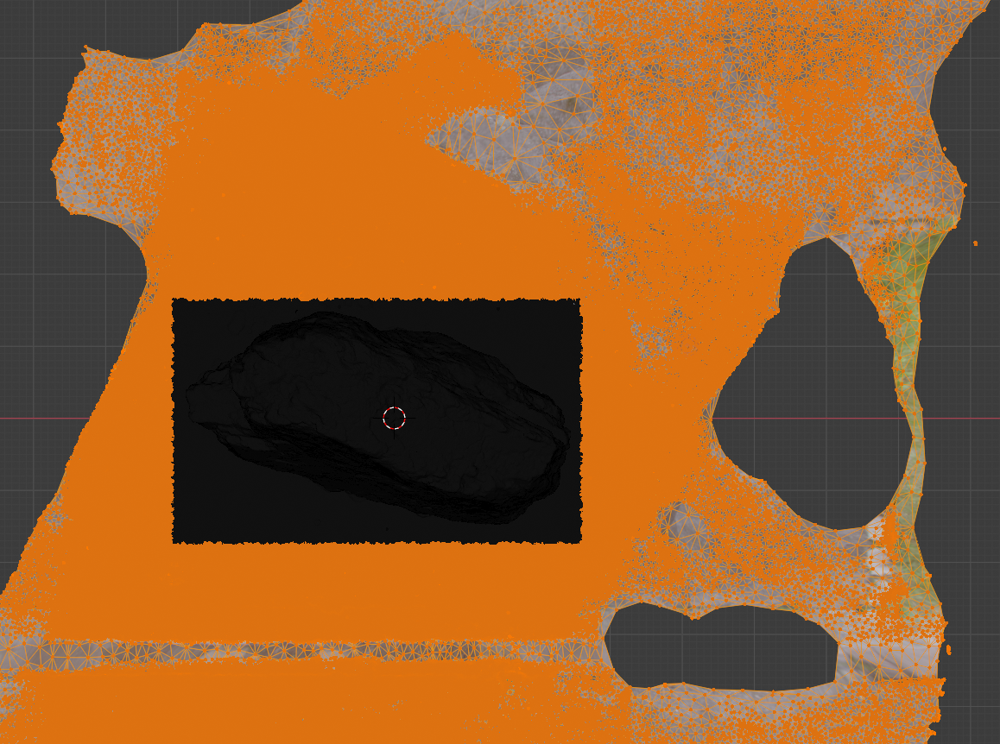

Select  a face on the resulting object, select linked with `ctrl-L`, invert, `DEL` and select _Vertices_. This gets rid of everything not directly connected to the main body of the object.

Now, we've cut down our high-poly mesh to what we want - before we start changing the mesh we need to take a copy that can be used for retexturing later.

Duplicate the object with `ctrl-D` (but `esc` so as not to move the duplicate) and, in the _Outliner_, rename the original to "high-poly", hide it and rename the copy to "low-poly".

All further work will be on "low-poly".

Go to its _Material Properties_ and delete all the textures, i.e. empty the list full of names like "TextureAtlas_1001" etc. by repeated pressing the minus button. The object will become white (if you're in _Material Preview_ mode).

Go to its _Object Data Properties_, expand the _UV Maps_ section and similarly delete the entry in the list there.

Non-shared vertices
-------------------

Now, to fix an odd problem with the meshes exported by Meshroom. The mesh is supposed to be continuous, each face connected to its neighbors. If we look at the following image the vetex at the center should be shared by the surrounding three triangles.

Later, we'll be dissolving vertices likes this. If the vertex is shared then when its dissolved, the faces that shared it will be merged.

However, this vertex here isn't actually shared. Each of the three surrounding triangles has its own vertex there and they just happen to share the same location.

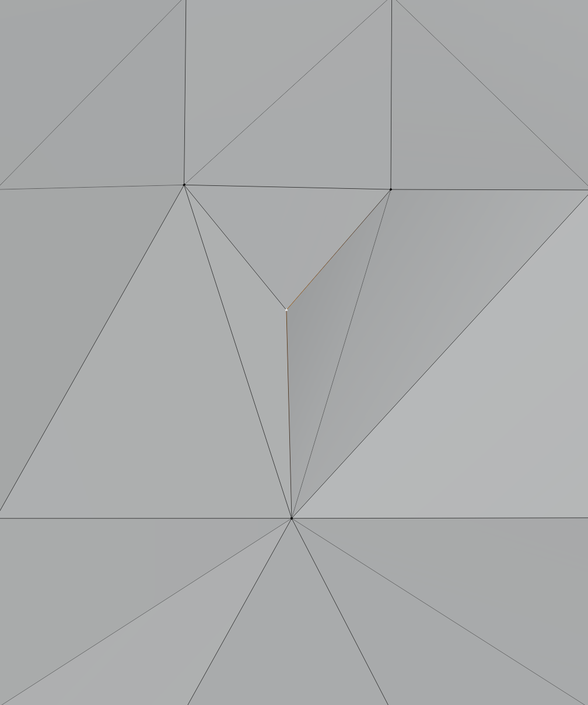

If I grab and move the vertex, I actually just move the vertex of one of those triangles and a hole opens up:

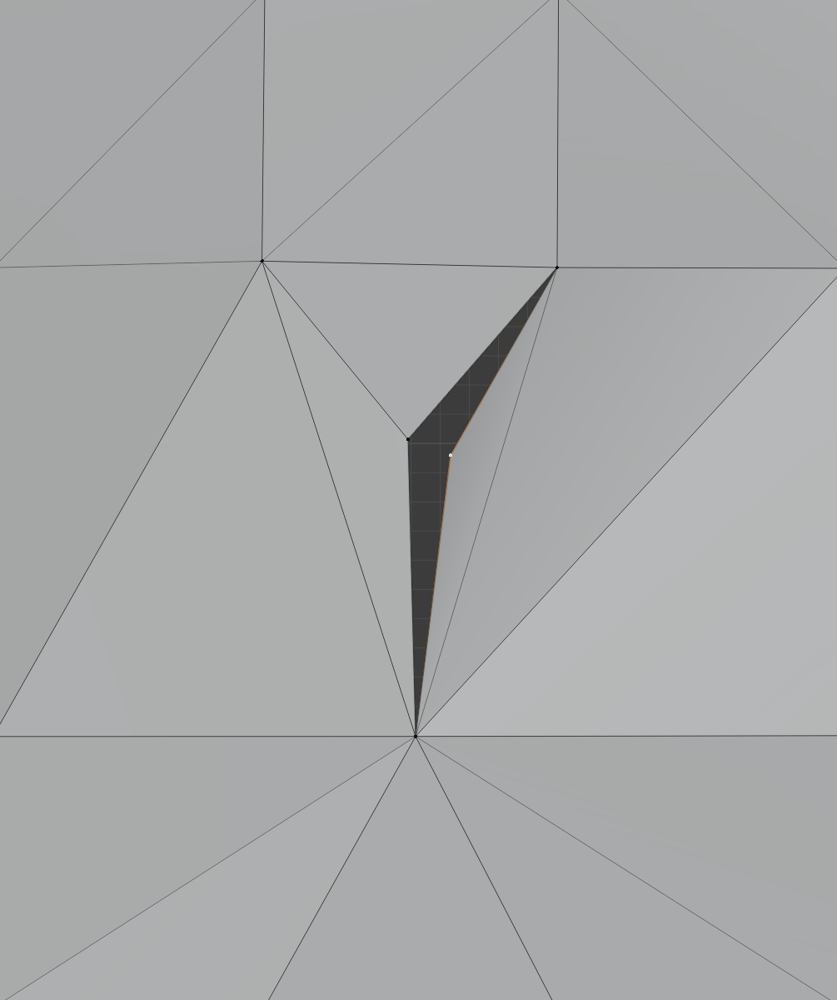

So these three triangles don't see each other as neighbors, in fact they see their apparently shared edges as unconnected boundaries of the mesh. If you turn on x-ray and drag select the center vertex then you select the three separate vertices of the three faces - if you then dissolve these, the three faces disappear rather than merge.

To fix this, we need to merge all such vertices - toggle to _Edit Mode_, go to _Mesh / Clean Up / Merge by Distance_.

We can also take our first opportunity to reduce the number of vertices, by upping the distance involved to 2mm:

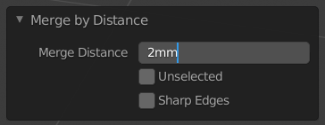

Once this is done, select _Mesh / Clean Up / Degenerate Dissolve_ - this will dissolve zero area faces and zero length edges.

Clean up
--------

Meshroom at least produces faces that are all nice triangles.

_Limited Dissolve_ will seriously reduce the number of faces but it produces highly irregular faces that are hard to work with, so afterwards we'll have to fix that up.

_Limited Dissolve_ will take a huge amount of time if you don't first decimate the mesh.

In _Object Mode_, add a _Decimate_ modifier, unselect _Realtime_ (the monitor icon), set ratio to 0.1 and _Apply_, i.e. `ctrl-A`.

Note: faces are still nice triangles after decimate.

Note: when doing select link and invert, to delete loose geometry (which oddly isn't deleted by _Clean Up / Delete Loose_), make sure to first select a face, select linked, then switch to vertex selection before deleting vertices, otherwise you can unexpectedly punch holes by e.g. deleting an unselected edge where one of the vertices touches a selected face's edge. Such a loose edge isn't selected when you select linked _faces_ but removing its vertex also destroys the face edge that it's touching.

Warning: even _Merge by Distance_ produces very odd results (and can punch holes) if the geometry isn't nice, i.e. planar and convex.

TODO: there are still issues with self-intersecting faces. You can break up such faces with _Face / Intersect (Knife)_ and then select _Self Intersect_. But this has unexpected results and can create holes - I don't know why. Doing self-intersect early, before limited dissolve etc., seems to introduce the least damage. But limited dissolve can reintroduce self-intersection so if you're going to try and clean up intersection issues, you'd have to do it _before_ doing limited dissolve.

Select _Mesh / Clean Up / Limited Dissolve_, for my object this more than halved the number of faces. However, it produces highly irregular faces that are hard to work so to fix that we'll actually increase the faces a bit:

* First select _Mesh / Clean Up / Split Non-Planar Faces_.
* First select _Mesh / Clean Up / Split Concave Faces_.

We're still about 40% down on faces even after splitting up faces like this.

Note: when I talk about "halved" etc., I'm talking about a particular typical object that I was working with. Numbers will be different for different objects.

After decimate 125,944 / 376,084 / 250,141
After limited dissolve 107,030 / 228,745 / 121,721
After split non-planar unchanged / 238,048 / 131,024
After split concave unchanged / 260,358 / 153,334

Filling holes
-------------

Add a cube and size and place it such that it covers everything except the area where the object touches its surrounding environment, i.e. the area where you can see inside the object - kind of a whole between inside and outside.

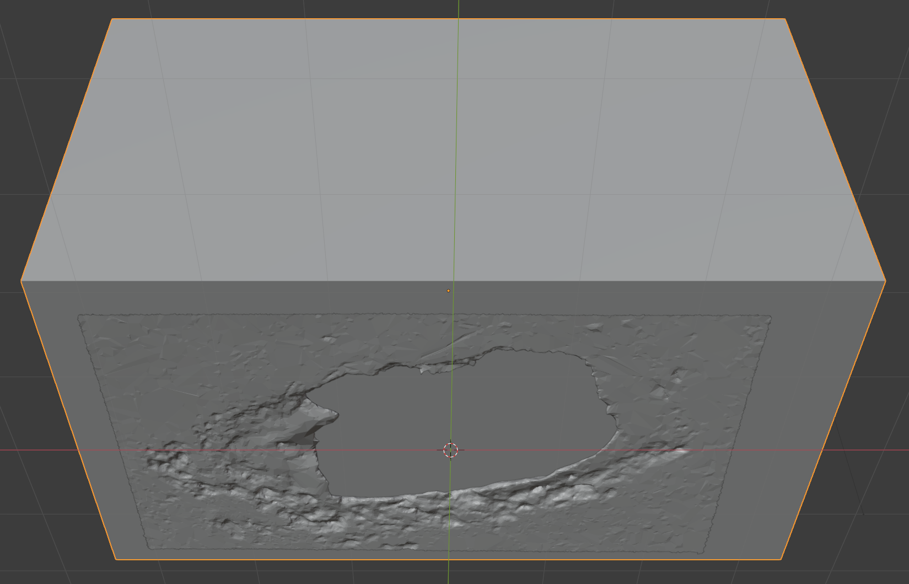

Add a _Boolean_ modifier to the low-poly object, unselect _Realtime_ (the monitor icon), set the operation to _Intersect_, select the cube as the _Object_ and _Apply_.

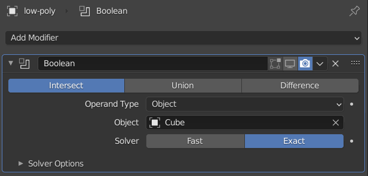

Then delete the cube, select a face on the main-body of the low-poly object, invert, `DEL` and select vertices.

The resulting object should now be sealed. If there's more than one hole into the inside of the object, you'll need to repeat the process. Filling small holes can be done by simply adding faces.

Note: ideally, the _Exact_ boolean solver wants manifold shapes - the low-poly object is still distinctly non-manifold. If it produces odd results then switch to the _Fast_ solver.

**Update:** I think it's better to take this step right at the start with the high-poly original - it makes it easier to compare the final result with the original if they're both essentially the same shape (rather than trimming off more of the mesh as here just for the low-poly object).

You could also achieve the same effect using the knife bisect tool to cut off the surrounding geometry and then filling in the resulting hole with a face. But I prefer the control this approach gives.

### Alternative - pedestal

Alternatively, create a pedestal:

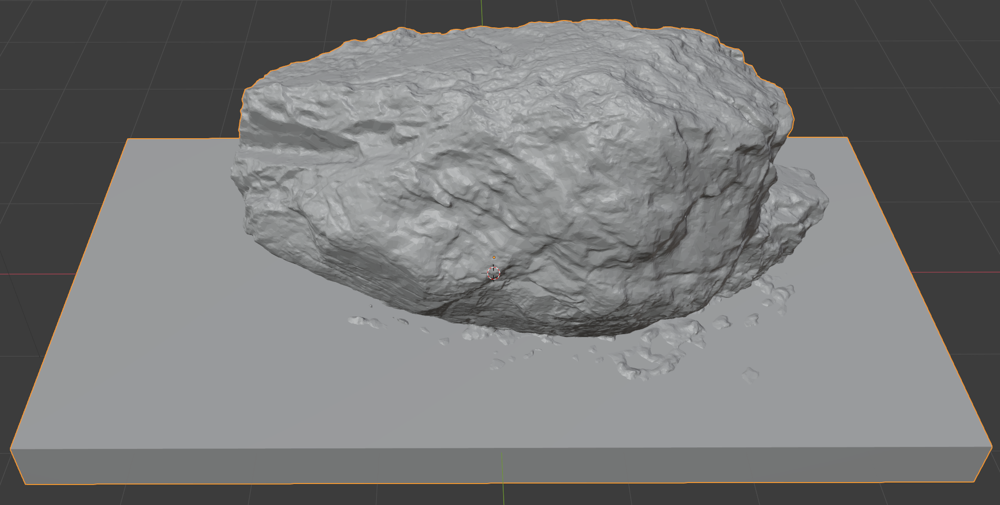

By using a union boolean modifier.

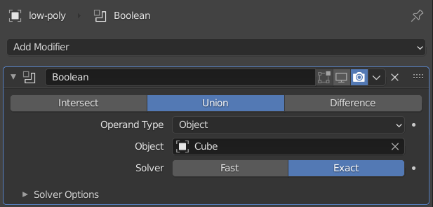

Remember to delete the cube afterwards.

### Filling holes

Depending on the mesh that Meshroom produced, the mesh may still be shot through with little holes.

So make sure you've got vertex select enabled (rather than edge or face) and select _Select / Select All by Trait / Non Manifold_, then select _Face / Fill_.

If there are no holes, this will do nothing. And if the holes are two unusual, it may not produce the results you want.

TODO: e.g. show weird star-burst holes in door object.

Remove non-manifold elements
----------------------------

Note: _Beautify Faces_ didn't reduce the number of non-manifold elements (for the rock object).

Make sure vertex select is enabled and _Select / Select All by Trait / Non Manifold_, `DEL` and select _Dissolve Vertices_ and then for the remaining non-face elements, `DEL` and select _Delete Vertices_.

Repeat these steps, trying dissolve first (if any faces or edges are selected) and then delete.

Hopefully relatively few faces are selected initially, e.g. 28 faces is the case of my rock, and these steps only have to be repeated once or twice.

TODO: oddly, these new faces may have the wrong normals - this can be fixed by _Mesh / Normals / Recalculate Outside_ (or _Inside_).

If the mesh has much more problematic geometry then you may have to engage in some serious manual clean up first.

Note: if you haven't sealed all the holes then the process will continue indefinitely as you dissolve and delete elements around these holes.

Remesh
------

Select _Object / Apply / All Transforms_, otherwise the remeshed mesh will orient itself according to the initial orientation of the object when it was imported from Meshroom.

**Important:** in 2.93, Quadriflow remesh often crashes so make sure to save before remeshing.

In _Object Mode_, go to _Object Data Properties, expand the _Remesh_ section, select _Quad_ and press _Quadriflow Remesh_. Enter e.g. 10,000 for the _Number of Faces_ and click _OK_.

### Issues with normals

If nothing happens and a warning appears in the status bar at the bottom of the screen that "The mesh needs to be manifold and have face normals that point in a consistent direction" then the real fun begins. As we've resolved the manifold issue, the remaining issue is with normals.

In simple cases it's possible to select _Mesh / Normals / Recalculate Outside_ but the issues Meshroom generates are not simple, they involve twisted intersecting geometry where it's not possible to automatically get things consistent.

Go to _Viewport Overlays_  and turn on _Face Orientation_ (and make sure x-ray is off). Hopefully, nearly everything is blue:

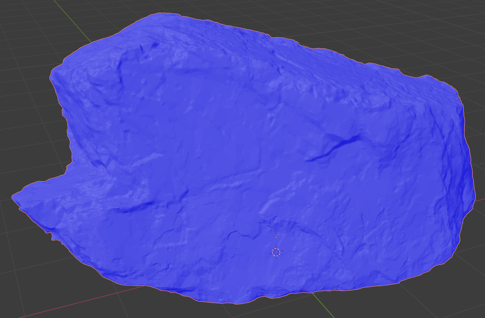

Now, begins a soul destroying search for tiny red faces among all the blue:

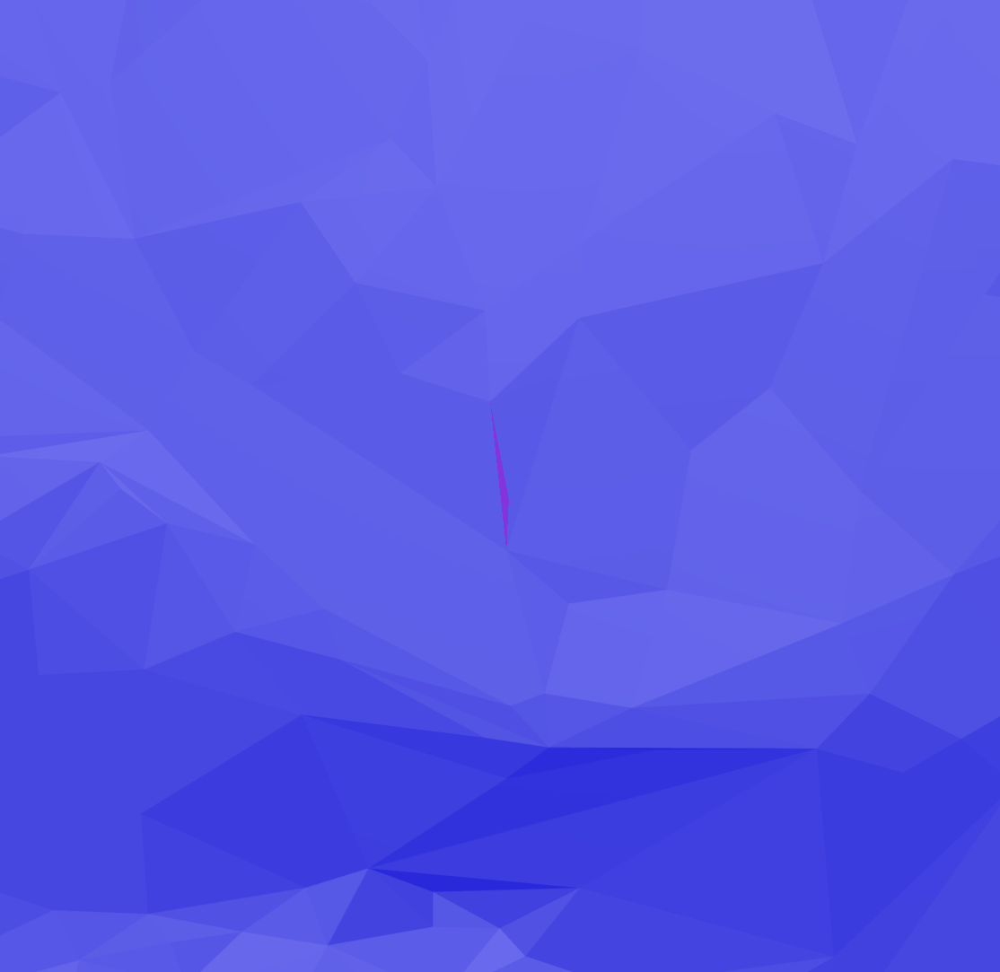

These are places where the geometry is so twisted around on itself that you're seeing what's supposed to be the inside facing side of a face.

You can resolve such issues by moving vertices around but the easiest thing to do is to select the problem face and then `DEL` and select _Dissolve Vertices_.

Unfortunately, this can result in non-manifold geometry - so try to find all red faces, dissolve them and then go through the steps for resolving non-manifold geometry again.

TODO: include image with labeled faces etc. along with explanation of what you're seeing from https://blender.stackexchange.com/q/230838/124535

TODO: Quadriflow knows what the problematic faces are. We've already got options for finding non-manifold issues so write a Python script to find the same faces with normal issues, as Quadriflow does when it complains, and select them.

### Remeshing continued

Assuming you've resolved all issues and the remesh succeeds, you'll find you end up with lots of faces on the bottom of the object (or wherever you filled in the big hole to the object's inside with the cude step):

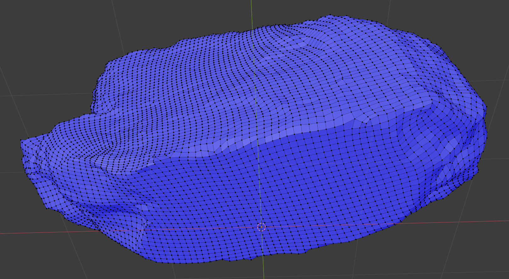

Lots of faces are good where there's lots of detail but they're pointless for big flat areas like this. So once the remesh is seen to succeed, undo it! This face was was just needed to make it easier to resolve the non-manifold issues (which otherwise gets very difficult if there are any holes).

Switch to _Edit Mode_ and face select, select the large flat face, `DEL` and select _Faces_. Now, we can see inside the object:

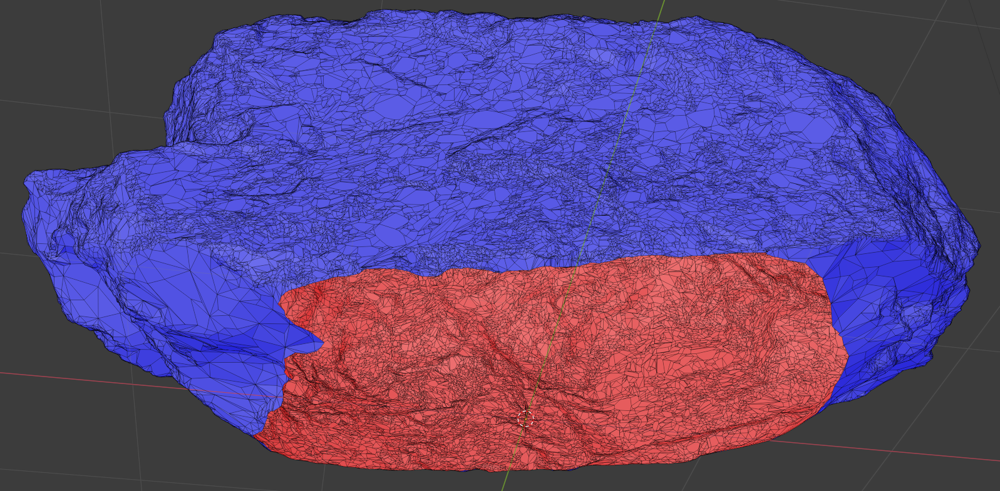

Then remesh. The resulting mesh is much cleaner but at the moment Quadriflow still seems to have its quirks and can produce odd geometry like here:

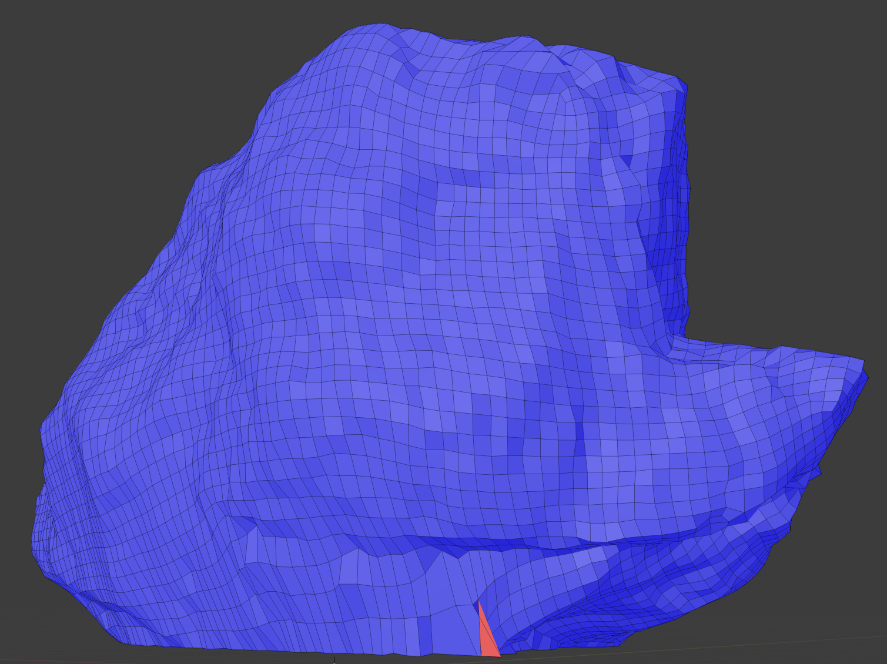

If there's a lot of this, try increasing the _Number of Faces_ value. Otherwise, just clean it up manually.

**Update:** my impression is that he Quadriflow remesher does particularly badly with edges so removing the bottom face (and thereby creating an edge between the inside and outside) results in worse results than you would have gotten otherwise. So I'd leave the base in place and if you really want, remove it _after_ remeshing with e.g. a knife bisect. In the case above the faces on the base made up just 3% of the total.

**Update 2:** having a hole though rather than a large pointless base face (or many pointless faces) makes for better UV unwrapping (the base doesn't consume some unreasonable portion of the UV map).

Rebake
------

Now, we can UV unwrap the low-poly object and bake the texture from the high-poly original onto it.

Go to the _UV Editing_ workspace, select all the vertices with `a`, press `u` and select _Smart UV Project_ (accept the defaults and press _OK_).

In the _UV Editor_, click _New_ and add an image called e.g. "rock" with dimensions 4096 px by 4096 px (and untick _Alpha_ as we don't need any transparency).

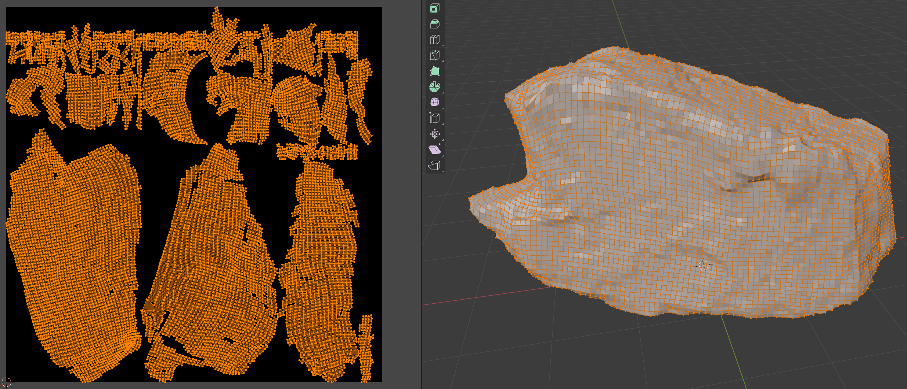

Switch to the _Shading_ workspace, make sure the object is selected and in the _Shader_ editor, click _New_ (there should be no existing nodes present as we removed all the textures, shared with the high-poly object, right at the start).

In the _Principled BSDF_ node, you can change _Specular_ to 0 or set _Roughness_ to 1 to match the original high-poly object.

TODO: go into why these values are important and why its basically one or the other if you set them to the extremes like this.  
TODO: Sketchfab seems to ignore your _Specular_ value, does it also ignore _Roughness_?  
UPDATE: it's actually the Blender .glb export that seems to lose the _Specular_ value (it you reimport what you've exported, the specular value is gone).

Press `shift-A` and, under _Texture_, select _Image Texture_. Wire it's _Color_ output to _Base Color_ and set its image to "rock".

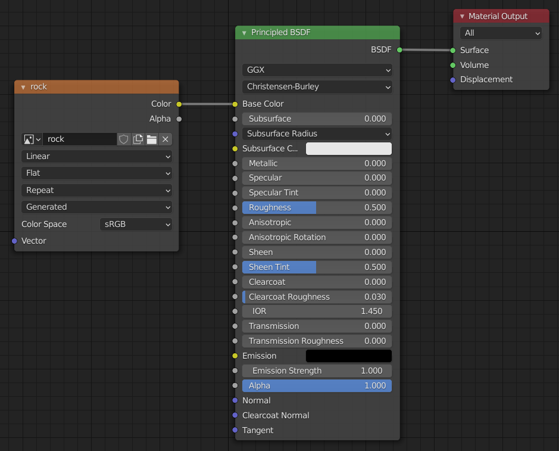

Now, switch back to the _Layout_ workspace, unhide the high-poly object, go to its _Render Properties_ and change the _Render Engine_ to _Cycles_. Expand the _Bake_ section (that's only available for _Cycles_), set the _Bake Type_ to _Diffuse_ and unselect _Direct_ and _Indirect_ (leaving just _Color_).

Note: make sure _Device_ is set to _GPU Compute_ rather than _CPU_ for _Cycles_.

Tick _Selected to Active_ and expand this area. Tick _Cage_ and enter a _Cage Extrusion_ of e.g. 5cm (the low-poly mesh is not quite the same shape as the high-poly mesh and the extrusion should cover the maximum possible distance between the two meshes - if the extrusion isn't quite big enough, you'll notice glitches at those points on the low-poly mesh that are further than the extrusion distance from the corresponding point on the high-poly mesh).

TODO: mention using a cage object instead to get more fine-grained control than a global extrusion value - though I don't see this ever really being useful.  
TODO: mention using _Max Ray Distance_ instead of _Cage_ and the resulting glitches - just moved stuff out of `1-bogie/README.md`

Now we're ready to bake. In the _Outliner_, select the high-poly object first then control-click the low-poly (make the first selected and the second active) and finally click _Bake_.

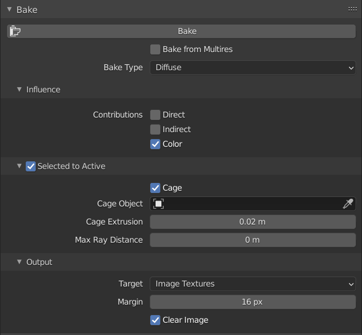

I often get something wrong in this sequence of steps or get things back the front when selecting and just end up with a black object (or even worse, I've destroyed the textures on the high-poly object). So always have things properly saved first.

Turn on _Smooth Shading_ for the low-poly object and switch to _Material Preview_ and you should have a great looking low-poly object with a regular mesh with none of the oddities of the original.

TODO: copy over stuff about saving the texture immediately.

**Note:** it's not entirely clear to me whether turning on smooth shading _before_ baking should affect the result. I did experiments where I mapped a [web mercator](https://en.wikipedia.org/wiki/Web_Mercator_projection) projection of the world onto a high-poly _UV Sphere_ (64 segments, 32 rings), with smooth shading turned on, and then baked from this object onto two low-poly UV spheres (16 segments, 8 rings), one with smooth shading and one with flat shading, and the results were identical. So I'm inclined to think it does _not_ affect things. However, if I understand this Blender StackExchange [answer](https://blender.stackexchange.com/a/215731/124535) correctly, smooth shading affects normals and this in turn should affect baking.

Note: when viewing with _Material Preview_, you won't notice much difference between flat and smooth shading but zoom in close and the difference is obvious.

Move the high-poly object out to the side of the low-poly one eye-ball them both side-by-side, looking for any issues. E.g. I initially set he _Cage Extrusion_ to 2cm and after baking there were clearly places where the texture on the low-poly object didn't match that of the high-poly one at all. Increasing the extrusion value to 5cm solved this problem.

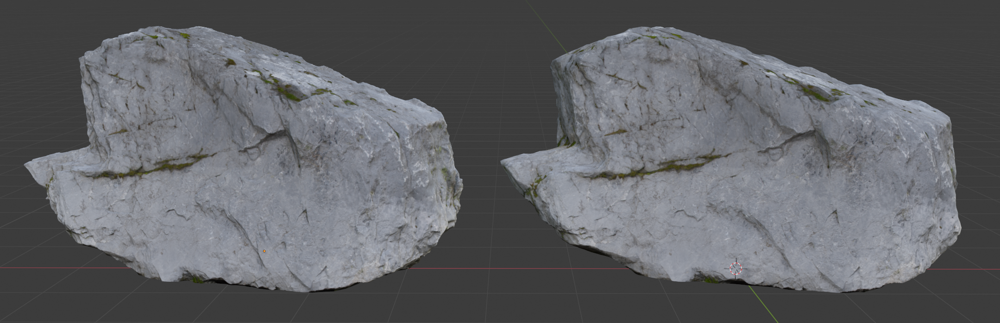

Alternatively...
----------------

Alternatively, don't bother with any of this remeshing work - just do the _Merge by Distance_ and _Degenerate Dissolve_ steps and then simply decimate straight down to the final number of triangles achieved by all the steps above.

E.g. after _Merge by Distance_ and _Degenerate Dissolve_, I had 2,130,835 triangles and after all the remeshing I had 16,905. Divide the first into the second and you get a decimate ratio of 0.008 - plug this into a _Decimate_ modifier and you get:

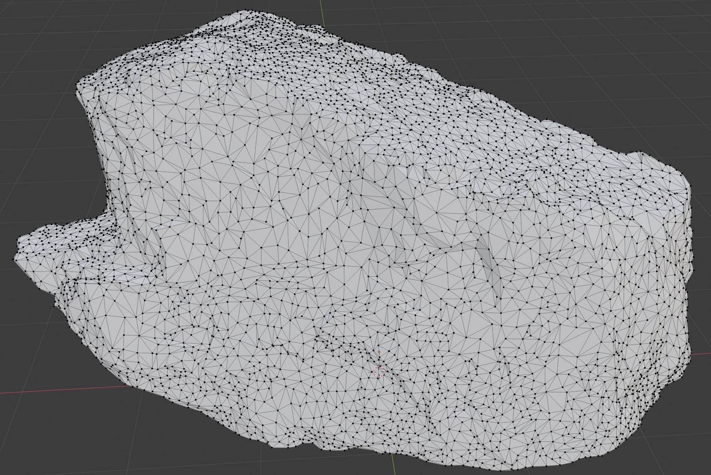

For the given number of triangles, this mesh actually much better matches the shape of out rock that the completely regular mesh.

Note: that the non-manifold nature of the mesh survives even this extreme decimation but in this case was trivial to resolve using the steps outlined above for removing non-manifold geometry. Removing non-manifold geometry is worth doing as twisted over faces clearly aren't part of what the mesh should be.

TODO: look for advantage to a regular mesh, is there more to it that being easy to work with (which isn't very important for a shape like a rock which you're unlikely to want to do much with). Does Viz.Guru go into it in his photogrammetry videos?

AutoRemesher
------------

---

`decimate-post-03-step.blend` contains the mesh created by applying a 0.008 decimate to the mesh after just _Merge by Distance_ and _Degenerate Dissolve_.  
`09a-bake-retry.blend` contains the mesh created with the Quadriflow remesher.

---

faces / edges / vertices

I think:
1. Merge by distance
2. Decimate to 0.1

I check - decimate doesn't merge-by-distance as a side effect. So merge-by-distance first, this fixes this issue, and it remains fixed thru decimate etc.

Original faces 2,722,027 / 4,083,850 / 1,361,822
Delete loose changed nothing.
Degenerate dissolve reduced faces to 2,721,931 (-96) / 4,083,754 (-96) / unchanged
Limited dissolve reduced faces to 433,244 / 1,022,404 / 589,159
Degenerate dissolve 433,242 (-2) / 1,022,402 (-1) / unchanged
Delete loose unchanged / 1,022,398 (-4) / 589,155 (-4)

---

Split non-planar 497,360 / 1,086,516 / unchanged

---

Split non-planar 497,360 / 1,086,516 / unchanged
Split concave 729,907 / 1,319,062 / unchanged

At this point I found that what looked like a vertice shared by multiple faces was actually multiple vertices on top of each other.

I.e. what looked like connected faces, weren't connected at all - they just had independent sets of vertices that were in the same locations.

If you go into x-ray mode, you can select and grab a group of vertices and move them together.

But if you disolve such a group of vertices, you end up with a hole - from the perspective of those vertices, there were no shared edges and faces to be merged.

So if you go to _Merge by Distance_, this resolves this issue - but bizarrely it doesn't affect the vertex count. I asked about that here:

https://blender.stackexchange.com/questions/230838/finding-faces-that-are-twisted-wrong-side-out-relative-to-their-neighbors#comment390978_230849

**Important:** I think I should have done _Merge by Distance_ at the start. And set a _Merge Distance_ of e.g. 2mm (then you definitely do see a change in counts).

After _Merge by Distance_ with _Merge Distance_ 2mm - 711,227 / 1,286,005 / 574,776

Intersect the rock with a cube so that you close off the hole at the base and get a solid shape with no hole thru to the inside - this gets rid of the non-manifold issues around the edge of the hole.

Decimate to a ratio of 0.2 - even if you're going to remesh, decimating makes it (just about) possible to see and hunt down the inside-out faces.

Note: it is possible by going up and down, thru vertices, edges and faces looking for loose geometry and eyeballing things to do it without decimation. But then Blender invariably crashes on remesh - so you have to decimate anyway to get things down to a size where it doesn't blow up. Select non-manifold, switch to faces and select disolve vertices Then try disolving remaining edges and vertices - does this ever work? If not just go straight for delete. Repeat these steps until there are no non-manifold items left.

Then it's hunt the twisted faces - this gets easier the higher the decimate so maybe 0.1 is better.

You have to go thru the non-manifold riga-ma-roll after removing twisted faces.

Hopefully eventually you have no twisted faces and a manifold and can finally quad remesh

The cube approach does mean you end up with a whole load of pointless faces on the base - so maybe once you've remeshed successfully, undo, remove the base and retry the remesh.

The nice rock here - https://sketchfab.com/3d-models/rock-stone-14-rawscan-3b8de09bc6344f46a493d86e4e4d9678 - has only 15k triangles whereas mines has 75k!

---

Selecting non-manifold and then dissolving vertices results in very strange results at edges of mesh.

So instead, switch to faces and then dissolve vertices.

---

Split concave 674,807 / 1,263,962 / unchanged

---

Ready to remesh

Split non-planar
9,140 / 2,373 / 3,232
unchanged / 2,393 / 3,352