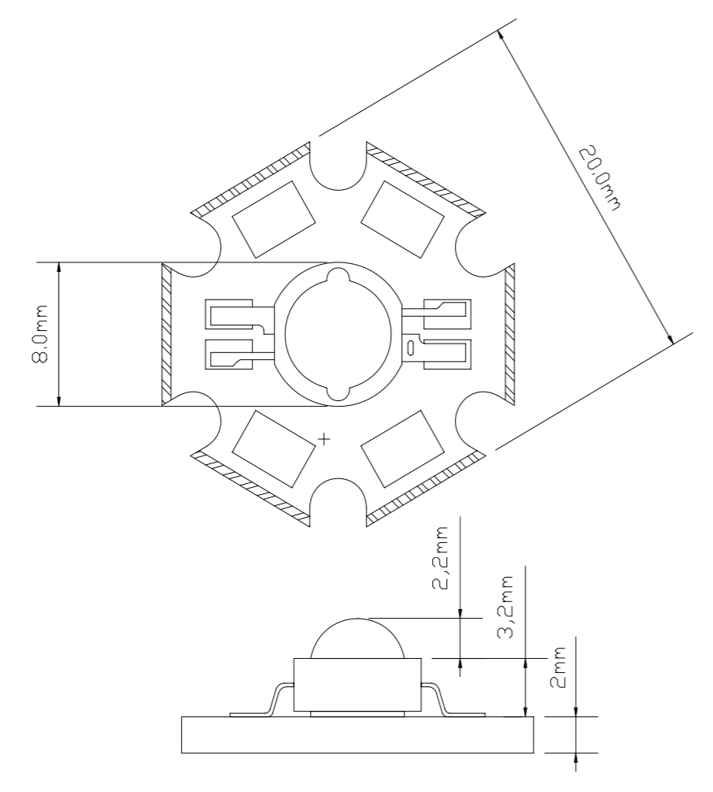
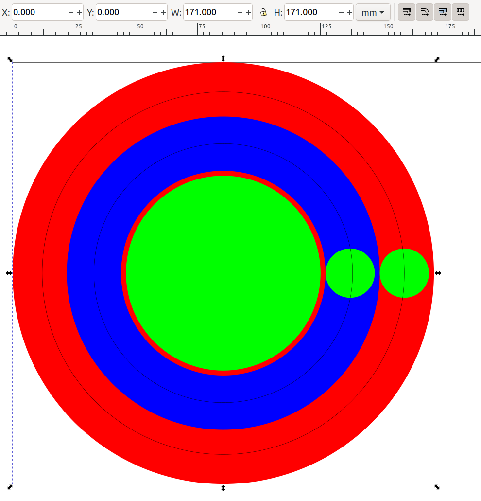
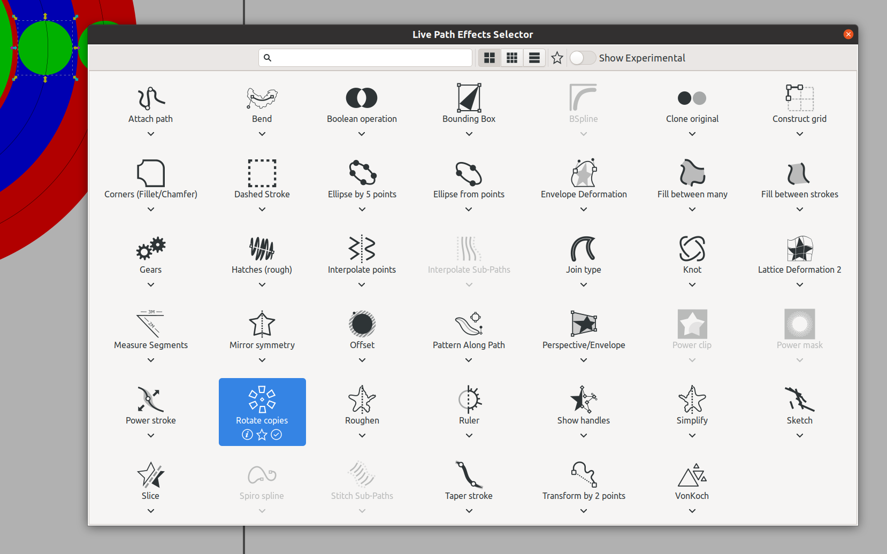
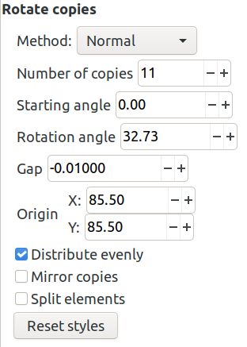
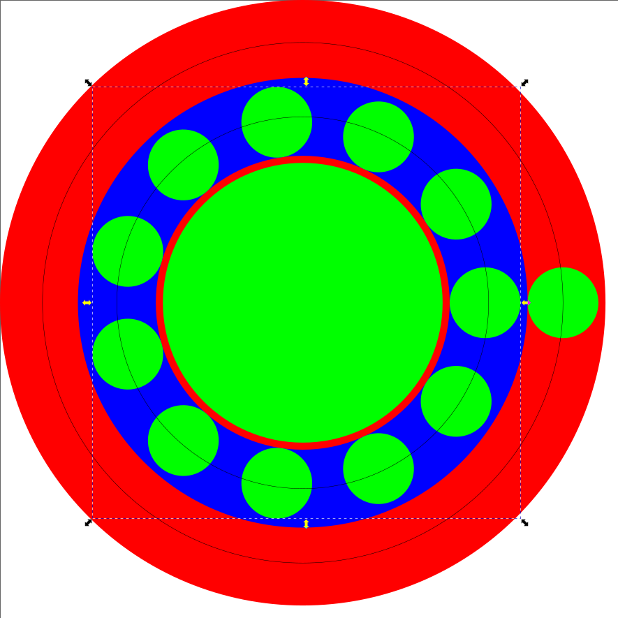
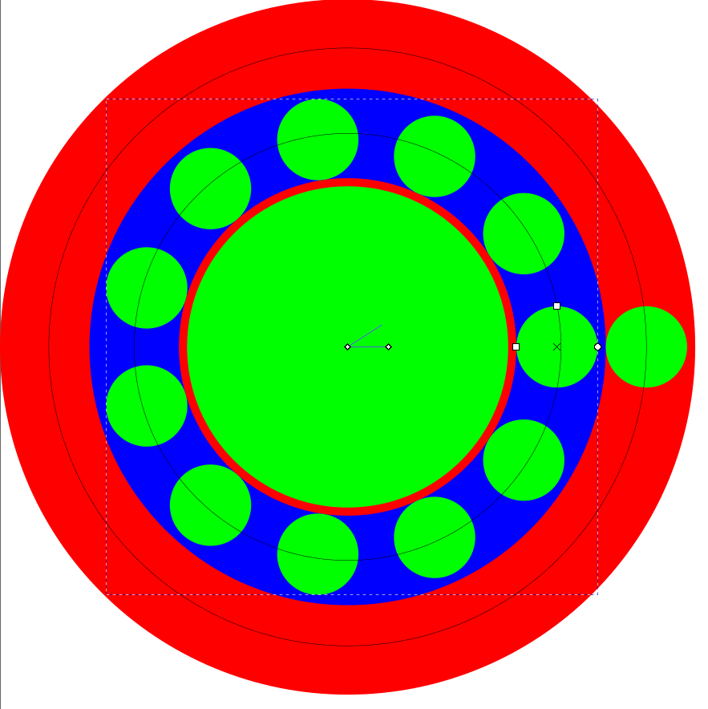

Dimensions
----------

Using the datasheet for the very similar [1W cool white LEDs](https://www.adafruit.com/product/518) from Adafruit, the LEDs are 20mm across with a tolerance of +/-0.25mm.

  

It's a hexagon with its corners snipped off, if we just look at the 8mm and 20mm values we can imagine a right angled triangle with legs 4mm and 10mm and hypotenuse of 10.77mm. So, with the tolerance above, a containing circle would need to be about 22mm.
It's a hexagon - a containing circle would need to have radius 10.77mm.

Distributing the LEDS
---------------------

I created my layout, grouped everything and moved it such that it's origin was (0, 0).



Given the shown width and height, the circles are clearly centered on (85.5, 85.5).

To distribute the small circles, first select _Path / Path Effects..._, the resulting docked dialog is a little bare initially except for a plus button to add an effect.

Ungroup the design and select e.g. the inner-most of the two small circles. Click the plus _Path Effects_ plus button and select _Rotate Copies_.



Enter the _Number of copies_, e.g. 11, and it will automatically calculate the rotation angle, so all that's left is to specify the origin, i.e. the values above (85.5, 85.5).



And you achieve the desired result:



Note: when I tried laying out the LEDs, I found that groups of objects didn't behave so well. For whatever reason, I could only achieve the correct layout for such groups by freehanding (as described next) and the relationship between the resulting original values and anything else was very non-obvious. By eliminating any grouping and reducing what I wanted to rotate to a single path, I could avoid this issue.

To freehand things, first select the _Edit path by nodes_:


Then various nodes appear, e.g. click on the center-most one and drag it about:



Laser services
--------------

Lasergist requires a total path length - this seems to be trivial to retrieve if using Illustrator but not so simple otherwise.

A possibility would be to _Combine_ all paths, save a plain SVG and then use node:

* Read the file - https://stackoverflow.com/a/29873674/245602
* Parse it - https://stackoverflow.com/a/19274609/245602
* Find the path, extract it as a string and get its total length with https://github.com/rveciana/svg-path-properties

If you go to https://www.npmjs.com/package/svg-path-properties you can do everything online:

* Click the _Try on RunKit_ button.
* Replace the contents of the text field with:

```javascript
var path = require("svg-path-properties");
const properties = new path.svgPathProperties("my-path");
const length = properties.getTotalLength();
```

* Replace `my-path` with e.g. `M 28.381227,39.563644 H 128.31363 V 139.49606 H 28.381227 Z`, i.e. open an SVG file as text and manually copy out the path string.
* Then click _run_, the answer is given without units but the result seems to be in the units you used, e.g. the above string is for a square with sides 100mm and the result produced by pressing _run_ is ~400.
